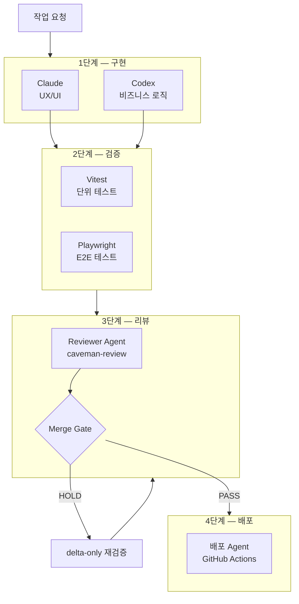

# 4단계 Agent 파이프라인

**적용 프로젝트: FMS · SAJU:ME**

---

:::info 개요
구현 → 검증 → 리뷰 → 배포의 4단계를 각각 독립된 Agent가 담당합니다.
단계별 품질 게이트를 통과해야만 다음 단계로 진행됩니다.
:::

---

## 파이프라인 전체 흐름



---

## 1단계 — 구현

| Agent | Skill | 담당 |
|---|---|---|
| Claude | web-design-guidelines, ui-ux-pro-max-skill | UI 컴포넌트 |
| Codex | next-best-practices, vercel-react-best-practices | 비즈니스 로직 |

**입력**: AGENTS.md + 해당 도메인 SKILL.md

**출력**: PR Draft

---

## 2단계 — 검증

구현 Agent가 작성한 코드를 검증 Agent가 자동 실행합니다.

```bash
# 검증 Agent 실행 순서
npm run type-check          # TypeScript 타입 검사
npm run test:unit           # Vitest 단위 테스트
npm run test:e2e            # Playwright E2E 테스트
npm run build               # 빌드 성공 여부
```

**검증 실패 시**: 검증 Agent가 실패 로그를 구현 Agent에 전달 → 수정 후 재검증.

---

## 3단계 — 리뷰 (Reviewer Agent)

`caveman-review` 기준으로 코드를 판정합니다.

```markdown title="Reviewer Agent 판정 기준"
## Critical (병합 차단)
- [ ] 런타임 에러 가능성 (null 참조, 타입 불일치)
- [ ] 보안 취약점 (XSS, 인증 누락)
- [ ] 테스트 없는 도메인 로직
- [ ] API 계약 위반 (Zod 스키마 미검증)

## Major (병합 차단)
- [ ] 성능 문제 (불필요한 전체 리렌더링)
- [ ] AGENTS.md 금지 행동 위반
- [ ] 슬라이스 경계 위반 (index.ts 우회)

## Minor (경고만)
- [ ] 네이밍 컨벤션 불일치
- [ ] 주석 누락
- [ ] 코드 중복

## 판정
MERGE: PASS  → 병합 허용
MERGE: HOLD  → Critical/Major 미해결 시 병합 차단
```

---

## 4단계 — 배포

Reviewer Agent가 `MERGE: PASS` 판정 시 배포 Agent가 GitHub Actions를 트리거합니다.

```yaml title=".github/workflows/deploy.yml"
name: Deploy

on:
  push:
    branches: [main]

jobs:
  deploy:
    runs-on: ubuntu-latest
    steps:
      - uses: actions/checkout@v4
      - run: npm ci
      - run: npm run build
      - name: Deploy to GitHub Pages
        uses: peaceiris/actions-gh-pages@v4
        with:
          github_token: ${{ secrets.GITHUB_TOKEN }}
          publish_dir: ./out
```

---

## delta-only 재검증

수정 후 변경된 부분만 재검증해 불필요한 전체 재실행을 피합니다.

```
HOLD 판정 → 수정 →
  변경된 파일 범위 파악 →
  해당 슬라이스 테스트만 재실행 →
  Reviewer Agent 변경 부분만 재판정 →
  PASS 시 병합
```

---

## 파이프라인 효과

:::tip 결과
- 구현·검증·배포 사이클 단축으로 생산성 향상
- 단계별 책임 분리로 Agent 정확도 95% 달성
- delta-only 재검증으로 검증 효율 확보
- Critical/Major 자동 차단으로 품질 기준 강제화
:::
