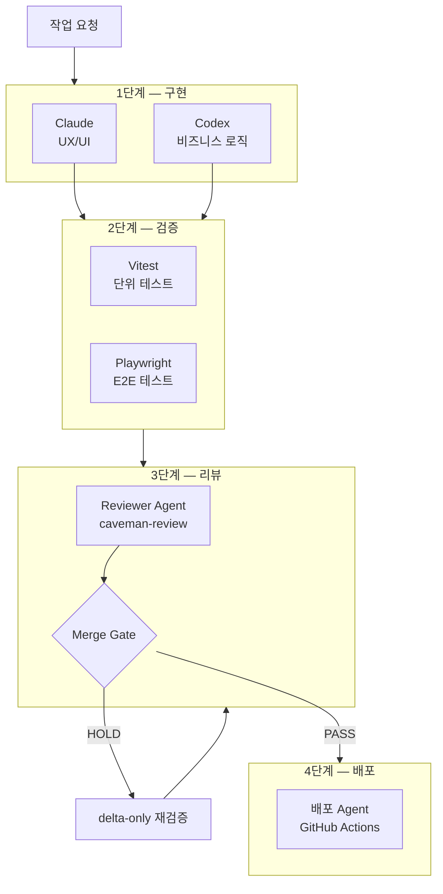

# 4단계 Agent 파이프라인

---

구현 → 검증 → 리뷰 → 배포의 4단계를 각각 독립된 Agent가 담당합니다.
단계별 품질 게이트를 통과해야만 다음 단계로 진행됩니다.

---

## 파이프라인 전체 흐름



---

## 1단계 — 구현

| Agent | Skill | 담당 |
|---|---|---|
| Claude | web-design-guidelines, ui-ux-pro-max-skill | UI 컴포넌트 |
| Codex | next-best-practices, vercel-react-best-practices | 비즈니스 로직 |

**입력**: AGENTS.md + 해당 도메인 SKILL.md

**출력**: PR Draft

---

## 2단계 — 검증

구현 Agent가 작성한 코드를 검증 Agent가 자동으로 실행합니다.

```bash
# 검증 Agent 실행 순서
npm run type-check          # TypeScript 타입 검사
npm run test:unit           # Vitest 단위 테스트
npm run test:e2e            # Playwright E2E 테스트
npm run build               # 빌드 성공 여부
```

**입력**: PR Draft (1단계 구현 결과)  
**출력**: 검증 결과 (PASS / FAIL + 상세 로그)

---

### 2.1 검증 항목 개요

| 항목 | 목적 | 검증 기준 | 판정 |
|------|------|---------|------|
| TypeScript 타입 검사 | 컴파일 타임 타입 안정성 | PASS: exit code 0 | CRITICAL |
| Vitest 단위 테스트 | 함수/컴포넌트 로직 정확성 | PASS: 80% 이상 커버리지 | CRITICAL |
| Playwright E2E 테스트 | 사용자 흐름 정상 작동 | PASS: 모든 시나리오 성공 | CRITICAL |
| npm build | 번들 최적화 & 배포 가능성 | PASS: 번들 크기 임계값 이내 | MAJOR |

---

### 2.2 TypeScript 타입 검사

**목적**: 컴파일 타임에 타입 불일치, null 참조, 타입 누락 감지

**검증 기준**:
- ✅ **PASS**: `npm run type-check` 성공 (exit code 0)
- ❌ **FAIL**: 타입 오류 존재

**적용 스킬**:
- **code-review-guard**: API 계약 위반 감지 (Zod 스키마 미검증, 타입 불일치)
- **next-best-practices**: 데이터 패턴 타입 안정성
- **vercel-react-best-practices**: Props 타입, 제네릭 타입 정확성

**실패 시 처리**:
1. TypeScript 컴파일러 에러 로그 수집
2. 오류 파일 + 라인 번호 + 에러 메시지 정리
3. 구현 Agent에 전달: "2단계 검증 실패: TypeScript 타입 오류"
4. 구현 Agent가 타입 수정 후 재커밋
5. delta-only 재검증: 변경된 파일만 타입 검사

**예시**:
```
❌ FAIL
Error: Type 'null | User' is not assignable to type 'User'
  at src/features/auth/model/useAuth.ts:42

Fix: Add null check or use optional chaining
```

---

### 2.3 Vitest 단위 테스트

**목적**: 함수, 컴포넌트, 훅의 로직이 정확한지 검증

**검증 기준**:
- ✅ **PASS**: 모든 테스트 성공, 커버리지 **80% 이상**
- ⚠️ **WARN**: 커버리지 60~80% (경고만, 병합 가능)
- ❌ **FAIL**: 테스트 실패 또는 커버리지 60% 미만

**적용 스킬**:
- **code-review-guard**: 도메인 로직 & 비즈니스 규칙 검증 여부 확인
- **next-best-practices**: Server Action, 데이터 페칭, state 관리 테스트 기준
- **vercel-react-best-practices**: Hook 동작, 렌더링 최적화 테스트 기준

**실패 시 처리**:
1. 실패한 테스트 케이스 수집
2. 스택 트레이스 + assertion 에러 메시지 정리
3. 영향받은 함수/컴포넌트 파악
4. 구현 Agent에 전달: "2단계 검증 실패: Vitest 테스트 실패 (3/25)"
5. 구현 Agent가 로직 수정 + 테스트 추가/수정
6. delta-only 재검증: 해당 파일의 테스트만 재실행

**예시**:
```
❌ FAIL
Expected: true
Received: false

Test: src/features/auth/model/__tests__/verifyToken.test.ts
  ✓ verifyToken returns token payload (45ms)
  ✗ verifyToken rejects expired token (12ms)
  ✗ verifyToken rejects invalid signature (8ms)

Coverage: 72% (warning - increase to 80%+)
```

---

### 2.4 Playwright E2E 테스트

**목적**: 사용자 흐름이 정상 작동하는지 검증 (네비게이션, 상호작용, 렌더링)

**검증 기준**:
- ✅ **PASS**: 모든 시나리오 테스트 성공
- ⚠️ **WARN**: 시간초과 경고 (일부 장비에서만, 50ms 미만)
- ❌ **FAIL**: 테스트 실패, 스크린샷 불일치, DOM 오류

**적용 스킬**:
- **web-design-guidelines**: UI 렌더링 정확성, 접근성 준수
- **vercel-react-best-practices**: Hydration 오류, 렌더링 성능, layout shift
- **code-review-guard**: UX 안정성 (사용자 상호작용 흐름, 상태 관리)

**실패 시 처리**:
1. 실패한 시나리오 + 오류 메시지 수집
2. 스크린샷 비교 (기대값 vs 실제값) 첨부
3. DOM 스냅샷, 콘솔 에러 수집
4. 구현 Agent에 전달: "2단계 검증 실패: E2E 테스트 실패 (로그인 흐름)"
5. 구현 Agent가 UI/로직 수정
6. delta-only 재검증: 영향받은 사용자 흐름 시나리오만 재실행

**예시**:
```
❌ FAIL
Scenario: User can login and access dashboard

Step: Click login button
  ✓ Navigate to /auth/login
  ✓ Fill email input
  ✓ Fill password input
  ✗ Click submit button
    Expected: Redirect to /dashboard
    Received: Redirect to /auth/login (re-render loop detected)

Screenshot comparison attached (diff: 3.2% pixels)
```

---

### 2.5 빌드 성공 여부 (npm build)

**목적**: 전체 번들이 최적화되어 배포 가능한 상태인지 확인

**검증 기준**:
- ✅ **PASS**: 빌드 성공, 번들 크기 임계값 이내
- ⚠️ **WARN**: 번들 크기 증가 10~20% (경고, 리뷰 권장)
- ❌ **FAIL**: 빌드 실패 또는 번들 크기 20% 이상 증가

**적용 스킬**:
- **bundle-size-optimization (next-best-practices)**: 배럴 파일 제거, dynamic import 사용 여부
- **vercel-react-best-practices**: 번들 크기, 코드 스플리팅, 불필요한 의존성
- **code-review-guard**: dead code, 미사용 import 제거

**실패 시 처리**:
1. 빌드 에러 로그 또는 번들 분석 리포트 수집
2. 크기 증가 항목 파악 (어떤 패키지/모듈이 증가했는가)
3. 구현 Agent에 전달: "2단계 검증 실패: 번들 크기 25% 증가 (next-best-practices 위반)"
4. 구현 Agent가 최적화 (배럴 import 제거, dynamic import 추가 등)
5. delta-only 재검증: 번들 크기 전체 확인 (영향 광범위)

**예시**:
```
⚠️ WARN
Build successful but bundle size increased

Baseline: 215 KB
Current:  248 KB (+15%)

Top increases:
  - lucide-react: 45 KB (barrel import detected)
  - react-query: 28 KB (unnecessary re-export)
  - @mui/material: 12 KB (unused components)

Action: Review bundle-barrel-imports & bundle-dynamic-imports rules
```

---

### 2.6 검증 Agent의 역할 (조정자)

검증 Agent는 **4개 검증 항목을 순차 실행**하고 결과를 종합합니다:

```
Step 1️⃣: npm run type-check
         ↓ (FAIL → 구현 Agent에 전달, 재검증 대기)
         ↓ (PASS → 다음 단계)

Step 2️⃣: npm run test:unit
         ↓ (FAIL → 구현 Agent에 전달, 재검증 대기)
         ↓ (PASS → 다음 단계)

Step 3️⃣: npm run test:e2e
         ↓ (FAIL → 구현 Agent에 전달, 재검증 대기)
         ↓ (PASS → 다음 단계)

Step 4️⃣: npm run build
         ↓ (FAIL → 구현 Agent에 전달, 재검증 대기)
         ↓ (PASS → 모든 검증 완료)

✅ 최종 결과: VALIDATION PASS → 3단계 (Reviewer Agent)로 진행
```

---

### 2.7 실패 후 처리 프로세스 (delta-only 재검증)

```
❌ 검증 Agent가 FAIL 감지 (예: TypeScript 에러)

    ↓ 에러 정보 수집 & 정제
    
📋 상세 정보 구성:
    - 실패 유형 (Type / Unit Test / E2E / Build)
    - 에러 메시지 + 파일 + 라인 번호
    - 스택 트레이스 (테스트 실패 시)
    - 스크린샷 비교 (E2E 실패 시)
    - 번들 분석 (빌드 실패 시)

    ↓ 구현 Agent에 전달
    
🔄 구현 Agent:
    - "2단계 검증 실패: [실패 타입]"
    - 에러 로그 분석 & 근본 원인 파악
    - 코드 수정 + 테스트 추가/수정
    - 변경 사항 커밋

    ↓ delta-only 재검증 시작
    
🔁 검증 Agent의 최적화된 재검증:
    
    TypeScript 재검증:
    └─ 변경된 파일 + 영향받는 타입 정의만 검사
    
    Vitest 재검증:
    └─ 해당 파일의 테스트만 재실행 (전체 60~90초 → 10~20초)
    
    Playwright 재검증:
    └─ 영향받은 사용자 흐름 시나리오만 실행 (전체 120초 → 20~40초)
    
    npm build:
    └─ 전체 번들 검사 (캐시 활용으로 30~60초)

    ↓ 최종 결과 판정
    
✅ 모든 항목 PASS
   └─ 다시 3단계 (Reviewer Agent)로 진행
   
❌ 여전히 FAIL
   └─ 재수정 요청 (검증 Agent → 구현 Agent)
   └─ 최대 재시도: 3회 (무한 루프 방지)
```

**delta-only의 효과**:
- 전체 재검증: ~350초 (Type + Unit + E2E + Build)
- delta-only 재검증: ~70초 (60~80% 단축)
- 작은 수정: ~30초 (평균)

---

## 3단계 — 리뷰 (Reviewer Agent)

`caveman-review` 기준으로 코드를 판정합니다.

```markdown title="Reviewer Agent 판정 기준"
## Critical (병합 차단)
- [ ] 런타임 에러 가능성 (null 참조, 타입 불일치)
- [ ] 보안 취약점 (XSS, 인증 누락)
- [ ] 테스트 없는 도메인 로직
- [ ] API 계약 위반 (Zod 스키마 미검증)

## Major (병합 차단)
- [ ] 성능 문제 (불필요한 전체 리렌더링)
- [ ] AGENTS.md 금지 행동 위반
- [ ] 슬라이스 경계 위반 (index.ts 우회)

## Minor (경고만)
- [ ] 네이밍 컨벤션 불일치
- [ ] 주석 누락
- [ ] 코드 중복

## 판정
MERGE: PASS  → 병합 허용
MERGE: HOLD  → Critical/Major 미해결 시 병합 차단
```

---

## 4단계 — 배포

Reviewer Agent가 `MERGE: PASS` 판정 시 배포 Agent가 GitHub Actions를 트리거합니다.

```yaml title="deploy.yml"
name: Deploy

on:
  push:
    branches: [main]

jobs:
  deploy:
    runs-on: ubuntu-latest
    steps:
      - uses: actions/checkout@v4
      - run: npm ci
      - run: npm run build
      - name: Deploy to GitHub Pages
        uses: peaceiris/actions-gh-pages@v4
        with:
          github_token: ${{ secrets.GITHUB_TOKEN }}
          publish_dir: ./out
```

---

## delta-only 재검증

수정 후 변경된 부분만 재검증해 불필요한 전체 재실행을 피합니다.

```
HOLD 판정 → 수정 →
  변경된 파일 범위 파악 →
  해당 슬라이스 테스트만 재실행 →
  Reviewer Agent 변경 부분만 재판정 →
  PASS 시 병합
```

---

## 파이프라인 효과

- 구현·검증·배포 사이클 단축으로 생산성 향상
- 단계별 책임 분리로 Agent 정확도 95% 달성
- delta-only 재검증으로 검증 효율 확보
- Critical/Major 자동 차단으로 품질 기준 강제화
