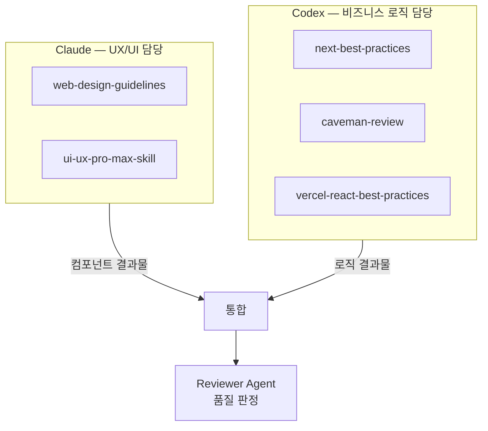

# Agent 역할 분리 — Claude vs Codex

**적용 프로젝트: FMS · SAJU:ME**

---

:::info 배경
AI Agent를 단순히 "코드 써줘" 방식으로 사용하면 UI와 비즈니스 로직이 뒤섞인 결과물이 나옵니다.
두 Agent의 강점을 분리해 각자가 잘하는 영역에만 집중하게 했습니다.
:::

---

## Agent 역할 분리 구조



---

## Claude — UX/UI 담당

| Skill | 역할 | 링크 |
|---|---|---|
| `web-design-guidelines` | 디자인 시스템 기준 참조, Tailwind 클래스 선택 기준 | [skills.sh](https://www.skills.sh/vercel-labs/agent-skills/web-design-guidelines) |
| `ui-ux-pro-max-skill` | 고품질 UI 컴포넌트·레이아웃 구현 기준 | [GitHub](https://github.com/nextlevelbuilder/ui-ux-pro-max-skill) |

**Claude가 담당하는 영역:**
- 컴포넌트 구조·레이아웃
- Tailwind CSS 클래스 선택
- 접근성(a11y) 속성
- 반응형 디자인
- 애니메이션·트랜지션

```
Claude에게 주는 컨텍스트 예시:
- SKILL: web-design-guidelines, ui-ux-pro-max-skill
- 역할: UI 컴포넌트 구현만 담당
- 금지: API 호출, 상태 관리 로직, 비즈니스 규칙 작성
```

---

## Codex — 비즈니스 로직 담당

| Skill | 역할 | 링크 |
|---|---|---|
| `next-best-practices` | Next.js Route Handler, Server Component, App Router 패턴 | [skills.sh](https://www.skills.sh/vercel-labs/next-skills/next-best-practices) |
| `caveman-review` | 코드 품질 판정 (Critical/Major/Minor 심각도) | [skills.sh](https://www.skills.sh/juliusbrussee/caveman/caveman-review) |
| `vercel-react-best-practices` | TanStack Query, Zustand, React 패턴 구현 | [skills.sh](https://www.skills.sh/vercel-labs/agent-skills/vercel-react-best-practices) |

**Codex가 담당하는 영역:**
- API Route Handler (BFF 패턴)
- TanStack Query 훅
- Zustand 스토어
- Zod 스키마 검증
- 도메인 로직·유틸

```
Codex에게 주는 컨텍스트 예시:
- SKILL: next-best-practices, vercel-react-best-practices
- 역할: 비즈니스 로직, API 연동, 상태 관리만 담당
- 금지: UI 스타일링, 클래스명 선택, 레이아웃 결정
```

---

## 역할 분리의 실제 효과

:::danger 분리 전 문제
단일 Agent에게 "점검 목록 페이지 만들어줘"를 요청하면:
- UI 스타일과 비즈니스 로직이 하나의 컴포넌트에 뒤섞임
- 수정 요청 시 UI를 고치다 로직이 깨지거나, 로직을 고치다 UI가 망가짐
:::

:::tip 분리 후 효과
- Claude: UI만 수정 → 로직 영향 없음
- Codex: 로직만 수정 → UI 영향 없음
- Agent 정확도 95% 달성 (하네스 엔지니어링 도입 후)
:::

---

## 다음 단계

- [하네스 엔지니어링 — AGENTS.md · SKILL.md 구조](/ai-workflow/harness-engineering)
- [4단계 파이프라인 — 구현·검증·리뷰·배포](/ai-workflow/agent-pipeline)
