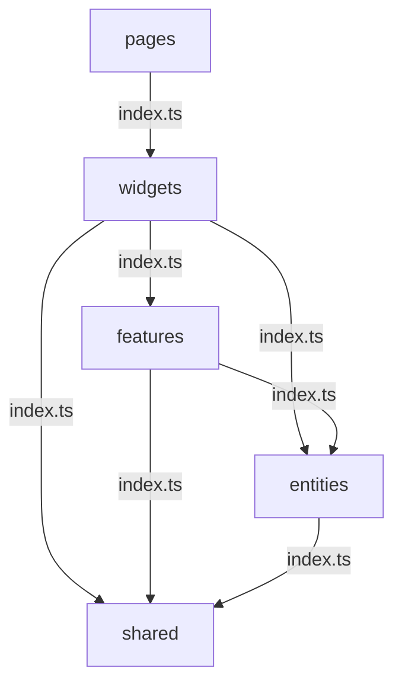

import Tabs from '@theme/Tabs';
import TabItem from '@theme/TabItem';

# Layered Architecture → FSD 전환


---

전역 레이어 중심 구조 비대화로 누적된 중복 코드, deep import, API 직접 의존 문제를 해결하기 위해 AI 기반 코드 분석을 도입했습니다. 

이를 통해 초기 JS 로드 비용과 유지보수 복잡도를 높이는 구조적 병목을 식별하고,
FSD 기준으로 기능 단위 경계 및 UI/API/상태 관리 책임 분리 전략을 수립할 수 있었습니다.

deep import를 약 74 ~ 84%, 라우터 직접 의존을 약 60 ~ 80%, page-service 결합도를 약 60 ~ 75%까지 줄이면서
초기 JS 로드 부담을 완화하고, 기능 단위 변경이 가능한 구조로 개선해 유지보수성과 확장성을 높였습니다.

---

## Before — Layered Architecture

```
src/
├── components/         ← 모든 도메인 컴포넌트 혼재
│   ├── EntityTree.tsx
│   ├── EntityChart.tsx
│   ├── EntityList.tsx
│   └── ...
├── hooks/              ← 모든 훅 혼재
│   ├── useEntityA.ts
│   ├── useEntityB.ts
│   └── useEntityC.ts
├── services/           ← API 호출 혼재
│   ├── entityAApi.ts
│   ├── entityBApi.ts
│   └── entityCApi.ts
└── store/              ← 전역 Redux 슬라이스
    ├── entityASlice.ts
    ├── entityBSlice.ts
    └── entityCSlice.ts
```

**문제점**: 특정 도메인 수정 시 `components/`, `hooks/`, `services/`, `store/` 4개 레이어를 모두 찾아다녀야 함.

---

## After — FSD (Feature-Sliced Design)

```
src/
├── entities/               ← 도메인 모델 (순수 타입·유틸)
│   ├── entity-a/
│   │   ├── model/
│   │   │   └── entity.ts
│   │   └── index.ts
│   ├── entity-b/
│   └── entity-c/
│
├── features/               ← 기능 단위 슬라이스
│   ├── entity-tree/
│   │   ├── api/
│   │   │   └── entityApi.ts
│   │   ├── model/
│   │   │   └── useEntityTree.ts
│   │   ├── ui/
│   │   │   └── EntityTree.tsx
│   │   └── index.ts        ← 외부 공개 인터페이스만 export
│   ├── entity-chart/
│   └── entity-list/
│
├── widgets/                ← features 조합
│   └── DomainWidget.tsx
│
├── pages/                  ← 라우트 진입점
│   └── DomainPage.tsx
│
└── shared/                 ← 공용 유틸·UI
    ├── ui/
    └── lib/
```

---

## FSD 핵심 규칙: import 방향



각 레이어는 `index.ts`를 통해서만 외부에 공개하며, 상위 레이어가 하위 레이어의 `index.ts`를 import하는 단방향 구조를 적용했습니다.

---

## 실제 코드 비교

<Tabs>
  <TabItem value="before" label="Before (Layered)">

```tsx title="EntityList.tsx"
import { useEntity } from '../hooks/useEntity';       // hooks 레이어 직접 참조
import { entityApi } from '../services/entityApi';    // services 레이어 직접 참조
import { useDispatch } from 'react-redux';
import { setSelected } from '../store/entitySlice';   // store 레이어 직접 참조

export function EntityList() {
    const dispatch = useDispatch();
    const { data } = useEntity();

    const handleSelect = (id: string) => {
        dispatch(setSelected(id));
    };
    // ...
}
```

  </TabItem>
  <TabItem value="after" label="After (FSD)">

```tsx title="EntityList.tsx"
import { useEntityList } from '../model/useEntityList'; // 같은 슬라이스 내 model
import type { Entity } from '@/entities/entity-a';      // entities 레이어

export function EntityList() {
    const { nodes, selectedId, select } = useEntityList();

    return (
        <ul>
            {nodes.map((node: Entity) => (
                <EntityItem
                    key={node.id}
                    node={node}
                    isSelected={node.id === selectedId}
                    onSelect={select}
                />
            ))}
        </ul>
    );
}
```

```ts title="index.ts"
// 외부에 공개할 인터페이스만 명시적으로 export
export { EntityList } from './ui/EntityList';
export { useEntityList } from './model/useEntityList';
```

기능 슬라이스별 public API를 정의해 외부 모듈이 내부 구현 경로에 직접 의존하지 않도록 제한했습니다.
이를 통해 내부 구현 경로에 직접 접근하는 deep import를 줄이고, 기능 단위 캡슐화를 강화했습니다.

  </TabItem>
</Tabs>

---

## 전환 효과

- 에러 수집 경로 일원화 및 운영 노이즈 감소
- 민감 데이터 노출 가능성 감소
- import 방향 규칙 기반 순환 의존 제거
- 신규 도메인 확장 시 기존 슬라이스 영향 최소화
