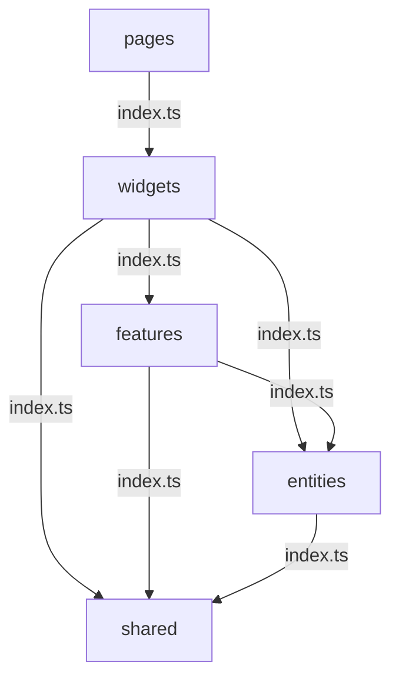

import Tabs from '@theme/Tabs';
import TabItem from '@theme/TabItem';

# Layered Architecture → FSD 전환

**적용 프로젝트: BEMS**

---

:::danger 문제
BEMS는 초기 Layered Architecture로 시작했지만, 도메인이 늘어나면서 각 레이어가 비대해졌습니다.
`components/` 폴더에 설비·에너지·알림 도메인 파일이 뒤섞여 수정 시 영향 범위를 파악하기 어려웠습니다.
:::

---

## Before — Layered Architecture

```
src/
├── components/         ← 모든 도메인 컴포넌트 혼재
│   ├── FacilityTree.tsx
│   ├── EnergyChart.tsx
│   ├── AlarmList.tsx
│   └── ...
├── hooks/              ← 모든 훅 혼재
│   ├── useFacility.ts
│   ├── useEnergy.ts
│   └── useAlarm.ts
├── services/           ← API 호출 혼재
│   ├── facilityApi.ts
│   ├── energyApi.ts
│   └── alarmApi.ts
└── store/              ← 전역 Redux 슬라이스
    ├── facilitySlice.ts
    ├── energySlice.ts
    └── alarmSlice.ts
```

**문제점**: 설비 도메인 수정 시 `components/`, `hooks/`, `services/`, `store/` 4개 레이어를 모두 찾아다녀야 함.

---

## After — FSD (Feature-Sliced Design)

```
src/
├── entities/               ← 도메인 모델 (순수 타입·유틸)
│   ├── facility/
│   │   ├── model/
│   │   │   └── facility.ts
│   │   └── index.ts
│   ├── energy/
│   └── alarm/
│
├── features/               ← 기능 단위 슬라이스
│   ├── facility-tree/
│   │   ├── api/
│   │   │   └── facilityApi.ts
│   │   ├── model/
│   │   │   └── useFacilityTree.ts
│   │   ├── ui/
│   │   │   └── FacilityTree.tsx
│   │   └── index.ts        ← 외부 공개 인터페이스만 export
│   ├── energy-chart/
│   └── alarm-list/
│
├── widgets/                ← features 조합
│   └── DashboardWidget.tsx
│
├── pages/                  ← 라우트 진입점
│   └── DashboardPage.tsx
│
└── shared/                 ← 공용 유틸·UI
    ├── ui/
    └── lib/
```

---

## FSD 핵심 규칙: import 방향



각 레이어는 `index.ts`를 통해서만 외부에 공개하며, 상위 레이어가 하위 레이어의 `index.ts`를 import하는 단방향 구조를 적용했습니다.

---

## 실제 코드 비교

<Tabs>
  <TabItem value="before" label="Before (Layered)">

```tsx title="components/FacilityTree.tsx"
import { useFacility } from '../hooks/useFacility';     // hooks 레이어 직접 참조
import { facilityApi } from '../services/facilityApi'; // services 레이어 직접 참조
import { useDispatch } from 'react-redux';
import { setSelected } from '../store/facilitySlice';  // store 레이어 직접 참조

export function FacilityTree() {
  const dispatch = useDispatch();
  const { data } = useFacility();

  const handleSelect = (id: string) => {
    dispatch(setSelected(id));
  };
  // ...
}
```

  </TabItem>
  <TabItem value="after" label="After (FSD)">

```tsx title="features/facility-tree/ui/FacilityTree.tsx"
import { useFacilityTree } from '../model/useFacilityTree'; // 같은 슬라이스 내 model
import type { Facility } from '@/entities/facility';        // entities 레이어

export function FacilityTree() {
  const { nodes, selectedId, select } = useFacilityTree();

  return (
    <ul>
      {nodes.map((node: Facility) => (
        <FacilityNode
          key={node.id}
          node={node}
          isSelected={node.id === selectedId}
          onSelect={select}
        />
      ))}
    </ul>
  );
}
```

```ts title="features/facility-tree/index.ts"
// 외부에 공개할 인터페이스만 명시적으로 export
export { FacilityTree } from './ui/FacilityTree';
export { useFacilityTree } from './model/useFacilityTree';
```

  </TabItem>
</Tabs>

---

## 전환 효과

:::tip 결과
- 도메인별 책임이 슬라이스 단위로 분리 → 설비 수정 시 `features/facility-tree/` 안에서만 작업
- import 방향 규칙으로 의존성 순환 제거
- 신규 도메인 추가 시 기존 슬라이스 영향 없음
:::
