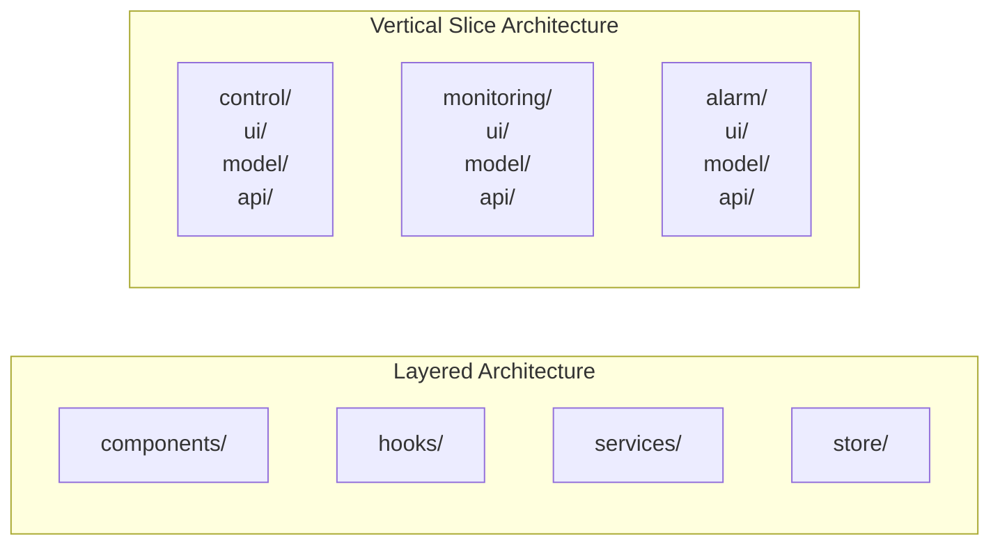

import Tabs from '@theme/Tabs';
import TabItem from '@theme/TabItem';

# Layered Architecture → Vertical Slice Architecture 전환

**적용 프로젝트: 공조기 자동제어**

---

:::danger 문제
Layered Architecture에서 공조기 제어 기능 하나를 수정하면
`components/`, `hooks/`, `services/`, `store/` 4개 레이어를 모두 건드려야 했습니다.
수정 영향 범위가 넓어 의도치 않은 사이드 이펙트가 자주 발생했습니다.
:::

---

## 핵심 차이: 레이어 vs 슬라이스



**Layered**: 기술 역할로 분리 → 기능 하나가 여러 레이어에 흩어짐

**VSA**: 기능(슬라이스)으로 분리 → 기능 하나가 한 폴더 안에 응집

---

## Before — Layered Architecture

```
src/
├── components/
│   ├── ControlPanel.tsx      ← 제어
│   ├── MonitoringChart.tsx   ← 모니터링
│   └── AlarmBanner.tsx       ← 알림
├── hooks/
│   ├── useControl.ts
│   ├── useMonitoring.ts
│   └── useAlarm.ts
├── services/
│   ├── controlApi.ts
│   ├── monitoringApi.ts
│   └── alarmApi.ts
└── store/
    ├── controlSlice.ts
    ├── monitoringSlice.ts
    └── alarmSlice.ts
```

---

## After — Vertical Slice Architecture

```
src/
├── features/
│   ├── control/              ← 제어 기능 전체가 여기
│   │   ├── ui/
│   │   │   └── ControlPanel.tsx
│   │   ├── model/
│   │   │   ├── useControl.ts
│   │   │   └── controlSlice.ts
│   │   ├── api/
│   │   │   └── controlApi.ts
│   │   └── index.ts
│   │
│   ├── monitoring/           ← 모니터링 기능 전체가 여기
│   │   ├── ui/
│   │   │   └── MonitoringChart.tsx
│   │   ├── model/
│   │   │   ├── useMonitoring.ts
│   │   │   └── monitoringSlice.ts
│   │   ├── api/
│   │   │   └── monitoringApi.ts
│   │   └── index.ts
│   │
│   └── alarm/                ← 알림 기능 전체가 여기
│
└── shared/                   ← 슬라이스 간 공유 코드만
    ├── ui/
    ├── lib/
    └── websocket/            ← 공용 WebSocket 클라이언트
```

---

## 실제 코드 비교

<Tabs>
  <TabItem value="before" label="Before (Layered) — 제어 명령 전송">

```ts title="hooks/useControl.ts"
import { controlApi } from '../services/controlApi';   // services 레이어 참조
import { useDispatch } from 'react-redux';
import { setControlState } from '../store/controlSlice'; // store 레이어 참조

export function useControl() {
  const dispatch = useDispatch();

  const sendCommand = async (deviceId: string, command: string) => {
    const result = await controlApi.send(deviceId, command);
    dispatch(setControlState(result));
  };

  return { sendCommand };
}
```

  </TabItem>
  <TabItem value="after" label="After (VSA) — 제어 명령 전송">

```ts title="features/control/model/useControl.ts"
import { sendControlCommand } from '../api/controlApi'; // 같은 슬라이스 내 api
import { useControlStore } from './controlSlice';       // 같은 슬라이스 내 model

export function useControl() {
  const { setState } = useControlStore();

  const sendCommand = async (deviceId: string, command: string) => {
    const result = await sendControlCommand(deviceId, command);
    setState(result);
  };

  return { sendCommand };
}
```

```ts title="features/control/index.ts"
// 슬라이스 외부에 공개할 인터페이스
export { ControlPanel } from './ui/ControlPanel';
export { useControl } from './model/useControl';
```

  </TabItem>
</Tabs>

---

## 전환 효과

| 항목 | Before (Layered) | After (VSA) |
|---|---|---|
| 제어 기능 수정 시 변경 파일 | 4개 레이어 각각 | `features/control/` 내부만 |
| 수정 영향 범위 | 전체 레이어 | **40% 축소** |
| 신규 기능 추가 | 레이어마다 파일 추가 | 슬라이스 폴더 하나 추가 |

:::tip 결과
수정 영향 범위 40% 축소. 슬라이스 단위 독립성으로 사이드 이펙트 감소.
:::
