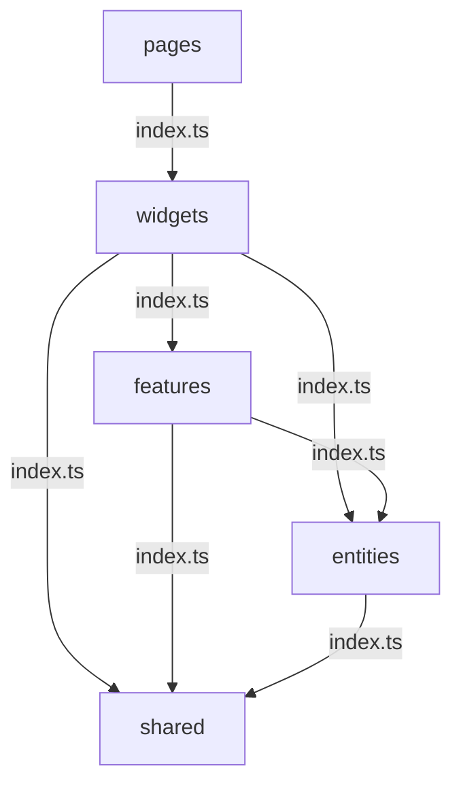

# 프로젝트별 아키텍처

프로젝트마다 구조를 선택한 이유는 달랐습니다.
여기서는 각 프로젝트에서 어떤 문제가 있었고, 그 문제를 해결하기 위해 왜 그 아키텍처가 필요했는지, 어떤 폴더 구조로 나눴는지, 그리고 결과가 어땠는지만 간단히 정리했습니다.

---

## FMS

### VSA 병렬 개발

FMS는 설비 관리로 시작한 프로젝트에 ERP 기능까지 편입되면서 운영 범위와 도메인 규모가 빠르게 커졌고, 2인 체제에서 여러 도메인을 병렬 개발해야 했습니다. 기획 단계에서는 일반적인 레이어 중심 구조로도 시작할 수 있었지만, 그렇게 가면 범위가 커질수록 UI, 상태, API 로직이 전역 폴더에 분산되고 기능 단위 변경 범위도 빠르게 불명확해질 수 있었습니다.

그래서 구현이 깊어지기 전에 구조 방향을 VSA로 바꿔, 도메인별 UI, model, api, schema를 하나의 슬라이스 안에 응집시켰습니다. 각 Agent는 담당 슬라이스만 수정하도록 경계를 제한하고, 외부 모듈은 `index.ts` public API를 통해서만 접근하도록 했습니다.

그 결과 슬라이스 간 충돌 없이 병렬 개발이 가능해졌고, 2인 체제에서도 확장된 도메인 전반을 안정적으로 커버할 수 있었습니다. 신규 도메인 추가 시에도 기존 슬라이스 영향 범위를 최소화할 수 있었습니다.

#### 폴더 구조

```text
src/
├── features/
│   ├── domain-a/            ← Agent A 담당
│   │   ├── ui/
│   │   │   ├── EntityList.tsx
│   │   │   └── EntityDetail.tsx
│   │   ├── model/
│   │   │   ├── useEntity.ts
│   │   │   └── entity.schema.ts
│   │   ├── api/
│   │   │   └── entityApi.ts
│   │   └── index.ts
│   │
│   ├── domain-b/            ← Agent B 담당
│   │   ├── ui/
│   │   ├── model/
│   │   ├── api/
│   │   └── index.ts
│   │
│   └── domain-c/            ← Agent C 담당
│
└── shared/
    ├── ui/
    ├── lib/
    │   └── queryClient.ts
    └── api/
        └── httpClient.ts
```

#### `index.ts` - 슬라이스 경계 강제

```ts title="index.ts"
export { EntityList } from './ui/EntityList';
export { EntityDetail } from './ui/EntityDetail';
export { useEntity } from './model/useEntity';
export type { Entity } from './model/entity.schema';

// 내부 구현 파일은 export 하지 않음 → 외부에서 직접 접근 불가
```

기능 슬라이스별 public API를 정의해 외부 모듈이 내부 구현 경로에 직접 의존하지 않도록 제한했습니다. 이를 통해 내부 구현 경로에 직접 접근하는 deep import를 줄이고, 기능 단위 캡슐화를 강화했습니다.

다른 슬라이스는 `index.ts`를 통해서만 접근:

```ts title="useDomainB.ts"
// ✅ index.ts 통해 접근
import type { Entity } from '@/features/domain-a';

// ❌ 내부 파일 직접 접근 금지
// import { entityApi } from '@/features/domain-a/api/entityApi';
```

#### Zod 스키마로 슬라이스 계약 명시

```ts title="entity.schema.ts"
import { z } from 'zod';

export const EntitySchema = z.object({
  id: z.string().uuid(),
  parentId: z.string(),
  status: z.enum(['pending', 'in_progress', 'completed', 'failed']),
  scheduledAt: z.string().datetime(),
  completedAt: z.string().datetime().nullable(),
  assignee: z.object({
    id: z.string(),
    name: z.string(),
  }),
});

export type Entity = z.infer<typeof EntitySchema>;
```

API 응답을 받을 때 스키마로 즉시 검증해 계약 위반을 런타임에서 바로 감지할 수 있도록 했습니다.

관련 문서:
[FMS](../projects/fms.md)
[AI Workflow](../ai-workflow/overview.md)

---

## BEMS

### Layered → FSD 전환

전역 레이어 중심 구조 비대화로 누적된 중복 코드, deep import, API 직접 의존 문제를 해결하기 위해 AI 기반 코드 분석을 도입했습니다.

이를 통해 초기 JS 로드 비용과 유지보수 복잡도를 높이는 구조적 병목을 식별하고, FSD 기준으로 기능 단위 경계 및 UI/API/상태 관리 책임 분리 전략을 수립할 수 있었습니다.

deep import를 약 74 ~ 84%, 라우터 직접 의존을 약 60 ~ 80%, page-service 결합도를 약 60 ~ 75%까지 줄이면서 초기 JS 로드 부담을 완화하고, 기능 단위 변경이 가능한 구조로 개선해 유지보수성과 확장성을 높였습니다.

#### Before - Layered Architecture

```text
src/
├── components/         ← 모든 도메인 컴포넌트 혼재
│   ├── EntityTree.tsx
│   ├── EntityChart.tsx
│   ├── EntityList.tsx
│   └── ...
├── hooks/              ← 모든 훅 혼재
│   ├── useEntityA.ts
│   ├── useEntityB.ts
│   └── useEntityC.ts
├── services/           ← API 호출 혼재
│   ├── entityAApi.ts
│   ├── entityBApi.ts
│   └── entityCApi.ts
└── store/              ← 전역 Redux 슬라이스
    ├── entityASlice.ts
    ├── entityBSlice.ts
    └── entityCSlice.ts
```

특정 도메인을 수정할 때마다 `components/`, `hooks/`, `services/`, `store/` 네 레이어를 모두 찾아다녀야 하는 구조였습니다.

#### After - FSD (Feature-Sliced Design)

```text
src/
├── entities/               ← 도메인 모델 (순수 타입·유틸)
│   ├── entity-a/
│   │   ├── model/
│   │   │   └── entity.ts
│   │   └── index.ts
│   ├── entity-b/
│   └── entity-c/
│
├── features/               ← 기능 단위 슬라이스
│   ├── entity-tree/
│   │   ├── api/
│   │   │   └── entityApi.ts
│   │   ├── model/
│   │   │   └── useEntityTree.ts
│   │   ├── ui/
│   │   │   └── EntityTree.tsx
│   │   └── index.ts        ← 외부 공개 인터페이스만 export
│   ├── entity-chart/
│   └── entity-list/
│
├── widgets/                ← features 조합
│   └── DomainWidget.tsx
│
├── pages/                  ← 라우트 진입점
│   └── DomainPage.tsx
│
└── shared/                 ← 공용 유틸·UI
    ├── ui/
    └── lib/
```

#### FSD 핵심 규칙 - import 방향



각 레이어는 `index.ts`를 통해서만 외부에 공개하며, 상위 레이어가 하위 레이어의 `index.ts`를 import하는 단방향 구조를 적용했습니다.

#### 실제 코드 비교

```tsx title="Before (Layered) - EntityList.tsx"
import { useEntity } from '../hooks/useEntity';       // hooks 레이어 직접 참조
import { entityApi } from '../services/entityApi';    // services 레이어 직접 참조
import { useDispatch } from 'react-redux';
import { setSelected } from '../store/entitySlice';   // store 레이어 직접 참조

export function EntityList() {
    const dispatch = useDispatch();
    const { data } = useEntity();

    const handleSelect = (id: string) => {
        dispatch(setSelected(id));
    };
    // ...
}
```

```tsx title="After (FSD) - EntityList.tsx"
import { useEntityList } from '../model/useEntityList'; // 같은 슬라이스 내 model
import type { Entity } from '@/entities/entity-a';      // entities 레이어

export function EntityList() {
    const { nodes, selectedId, select } = useEntityList();

    return (
        <ul>
            {nodes.map((node: Entity) => (
                <EntityItem
                    key={node.id}
                    node={node}
                    isSelected={node.id === selectedId}
                    onSelect={select}
                />
            ))}
        </ul>
    );
}
```

```ts title="index.ts"
// 외부에 공개할 인터페이스만 명시적으로 export
export { EntityList } from './ui/EntityList';
export { useEntityList } from './model/useEntityList';
```

기능 슬라이스별 public API를 정의해 외부 모듈이 내부 구현 경로에 직접 의존하지 않도록 제한했습니다. 이를 통해 내부 구현 경로에 직접 접근하는 deep import를 줄이고, 기능 단위 캡슐화를 강화했습니다.

#### 전환 효과

- 에러 수집 경로 일원화 및 운영 노이즈 감소
- 민감 데이터 노출 가능성 감소
- import 방향 규칙 기반 순환 의존 제거
- 신규 도메인 확장 시 기존 슬라이스 영향 최소화

관련 문서:
[BEMS](../projects/bems.md)
[데이터 정합성 · 검증 체계](../projects/bems-data-validation.md)

---

## 원격 제어 시스템

### Layered → VSA 전환

기존 Layered Architecture 기반 구조에서는 화면, API 호출, 상태 관리, 실시간 소켓 처리 로직이 전역 레이어에 분산되어 기능 단위 변경 시 여러 계층을 동시에 수정해야 하는 문제가 있었습니다.

특히 Socket.IO + MQTT 기반 장비 상태 갱신 로직이 페이지별로 직접 연결되고, 메시지 리스너 cleanup과 브로드캐스트 책임이 명확히 분리되지 않아 화면 전환 시 상태 갱신 누락, 중복 수신, 연결 관리 복잡도가 발생할 수 있었습니다.

이를 해결하기 위해 AI 기반 코드 분석으로 기능별 의존 흐름과 실시간 메시지 처리 경계를 식별했고, Layered Architecture에서 Vertical Slice Architecture 중심으로 구조를 재설계했습니다.

그 결과 장비 상태 갱신 기능을 UI/API/상태/실시간 처리 책임 단위로 응집시키고, 공통 소켓 모듈과 서버 단일 브로드캐스트 구조를 도입해 기능 단위 변경이 가능한 구조로 개선했습니다.

#### Before - Layered Architecture

```text
src/
├── components/
│   ├── EntityPanel.tsx       ← Domain A
│   ├── EntityChart.tsx       ← Domain B
│   └── EntityBanner.tsx      ← Domain C
├── hooks/
│   ├── useEntityA.ts
│   ├── useEntityB.ts
│   └── useEntityC.ts
├── services/
│   ├── entityAApi.ts
│   ├── entityBApi.ts
│   └── entityCApi.ts
└── store/
    ├── entityASlice.ts
    ├── entityBSlice.ts
    └── entityCSlice.ts
```

#### After - Vertical Slice Architecture

```text
src/
├── features/
│   ├── domain-a/             ← Domain A 기능 전체가 여기
│   │   ├── ui/
│   │   │   └── EntityPanel.tsx
│   │   ├── model/
│   │   │   ├── useEntity.ts
│   │   │   └── entitySlice.ts
│   │   ├── api/
│   │   │   └── entityApi.ts
│   │   └── index.ts
│   │
│   ├── domain-b/             ← Domain B 기능 전체가 여기
│   │   ├── ui/
│   │   │   └── EntityChart.tsx
│   │   ├── model/
│   │   │   ├── useEntity.ts
│   │   │   └── entitySlice.ts
│   │   ├── api/
│   │   │   └── entityApi.ts
│   │   └── index.ts
│   │
│   └── domain-c/             ← Domain C 기능 전체가 여기
│
└── shared/                   ← 슬라이스 간 공유 코드만
    ├── ui/
    ├── lib/
    └── websocket/            ← 공용 실시간 통신 클라이언트
```

#### 실제 코드 비교

```ts title="Before (Layered) - hooks/useEntity.ts"
import { entityApi } from '../services/entityApi';     // services 레이어 참조
import { useDispatch } from 'react-redux';
import { setEntityState } from '../store/entitySlice';  // store 레이어 참조

export function useEntity() {
  const dispatch = useDispatch();

  const sendCommand = async (entityId: string, command: string) => {
    const result = await entityApi.send(entityId, command);
    dispatch(setEntityState(result));
  };

  return { sendCommand };
}
```

```ts title="After (VSA) - useEntity.ts"
import { sendEntityCommand } from '../api/entityApi'; // 같은 슬라이스 내 api
import { useEntityStore } from './entitySlice';       // 같은 슬라이스 내 model

export function useEntity() {
  const { setState } = useEntityStore();

  const sendCommand = async (entityId: string, command: string) => {
    const result = await sendEntityCommand(entityId, command);
    setState(result);
  };

  return { sendCommand };
}
```

```ts title="domain-a/index.ts"
// 슬라이스 외부에 공개할 인터페이스
export { EntityPanel } from './ui/EntityPanel';
export { useEntity } from './model/useEntity';
```

기능 슬라이스별 public API를 정의해 외부 모듈이 내부 구현 경로에 직접 의존하지 않도록 제한했습니다. 이를 통해 슬라이스 내부 구조 변경이 외부 사용처로 전파되는 문제를 줄였습니다.

#### 전환 효과

| 항목 | Before (Layered) | After (VSA) |
|---|---|---|
| 도메인 기능 수정 시 변경 파일 | 4개 레이어 각각 | `features/domain-a/` 내부만 |
| 수정 영향 범위 | 전체 레이어 | **40% 축소** |
| 신규 기능 추가 | 레이어마다 파일 추가 | 슬라이스 폴더 하나 추가 |

수정 영향 범위 40% 축소. 슬라이스 단위 독립성으로 사이드 이펙트 감소.

관련 문서:
[원격 제어 및 모니터링](../projects/hvac-control.md)
[AWS IoT 제어 흐름](../realtime/aws-iot-control.md)
[멱등성 검증 & 중복 필터](../realtime/dedup-idempotency.md)
