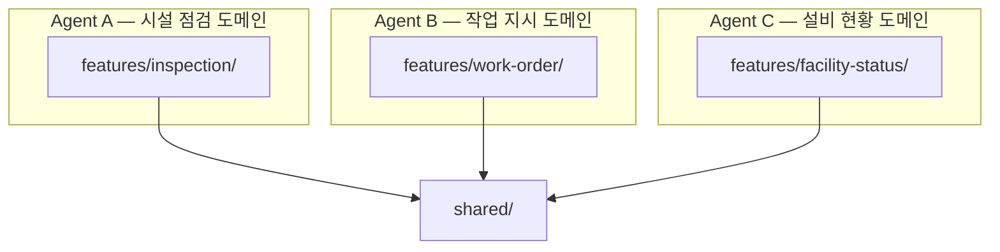

# Vertical Slice Architecture — Agent 병렬 개발

**적용 프로젝트: FMS**

---

:::info 배경
FMS는 30개 이상의 라우트(도메인)를 개발해야 했습니다.
개발 인원이 3명에서 2명으로 줄었지만, AI Agent를 도메인별로 독립 할당해 전체 커버리지를 유지했습니다.
VSA의 슬라이스 독립성이 이를 가능하게 했습니다.
:::

---

## 왜 VSA가 병렬 개발에 유리한가



각 Agent는 **자신의 슬라이스 폴더만** 수정합니다.
`shared/`는 공용 컴포넌트·유틸만 포함 → 슬라이스 간 충돌 없음.

---

## 폴더 구조

```
src/
├── features/
│   ├── inspection/          ← Agent A 담당
│   │   ├── ui/
│   │   │   ├── InspectionList.tsx
│   │   │   └── InspectionDetail.tsx
│   │   ├── model/
│   │   │   ├── useInspection.ts
│   │   │   └── inspection.schema.ts   ← Zod 스키마
│   │   ├── api/
│   │   │   └── inspectionApi.ts       ← HeyAPI 자동생성
│   │   └── index.ts
│   │
│   ├── work-order/          ← Agent B 담당
│   │   ├── ui/
│   │   ├── model/
│   │   ├── api/
│   │   └── index.ts
│   │
│   └── facility-status/     ← Agent C 담당
│
└── shared/
    ├── ui/                  ← 공용 컴포넌트 (Button, Table, Modal ...)
    ├── lib/
    │   └── queryClient.ts
    └── api/
        └── httpClient.ts    ← Axios 공통 클라이언트
```

---

## 슬라이스 독립성을 보장하는 index.ts 규칙

```ts title="features/inspection/index.ts"
// 외부에서 접근 가능한 인터페이스만 명시적으로 export
export { InspectionList } from './ui/InspectionList';
export { InspectionDetail } from './ui/InspectionDetail';
export { useInspection } from './model/useInspection';
export type { Inspection } from './model/inspection.schema';

// ❌ 내부 구현 파일은 export 하지 않음
// export { inspectionApi } from './api/inspectionApi'; // 비공개
```

다른 슬라이스에서는 `index.ts`를 통해서만 접근:

```ts title="features/work-order/model/useWorkOrder.ts"
// ✅ index.ts 통해 접근
import type { Inspection } from '@/features/inspection';

// ❌ 내부 파일 직접 접근 금지
// import { inspectionApi } from '@/features/inspection/api/inspectionApi';
```

---

## Zod 스키마로 슬라이스 계약 명시

```ts title="features/inspection/model/inspection.schema.ts"
import { z } from 'zod';

export const InspectionSchema = z.object({
  id: z.string().uuid(),
  facilityId: z.string(),
  status: z.enum(['pending', 'in_progress', 'completed', 'failed']),
  scheduledAt: z.string().datetime(),
  completedAt: z.string().datetime().nullable(),
  inspector: z.object({
    id: z.string(),
    name: z.string(),
  }),
});

export type Inspection = z.infer<typeof InspectionSchema>;
```

Agent가 API 응답을 받을 때 스키마로 즉시 검증 → 계약 위반 시 런타임에서 즉시 감지.

---

## 병렬 개발 효과

:::tip 결과
- 30개 이상 라우트를 Agent별 도메인 독립 할당으로 병렬 개발
- 개발 인원 3→2명에도 전 도메인 커버리지 유지
- 슬라이스 간 충돌 없이 동시 작업 가능
:::
