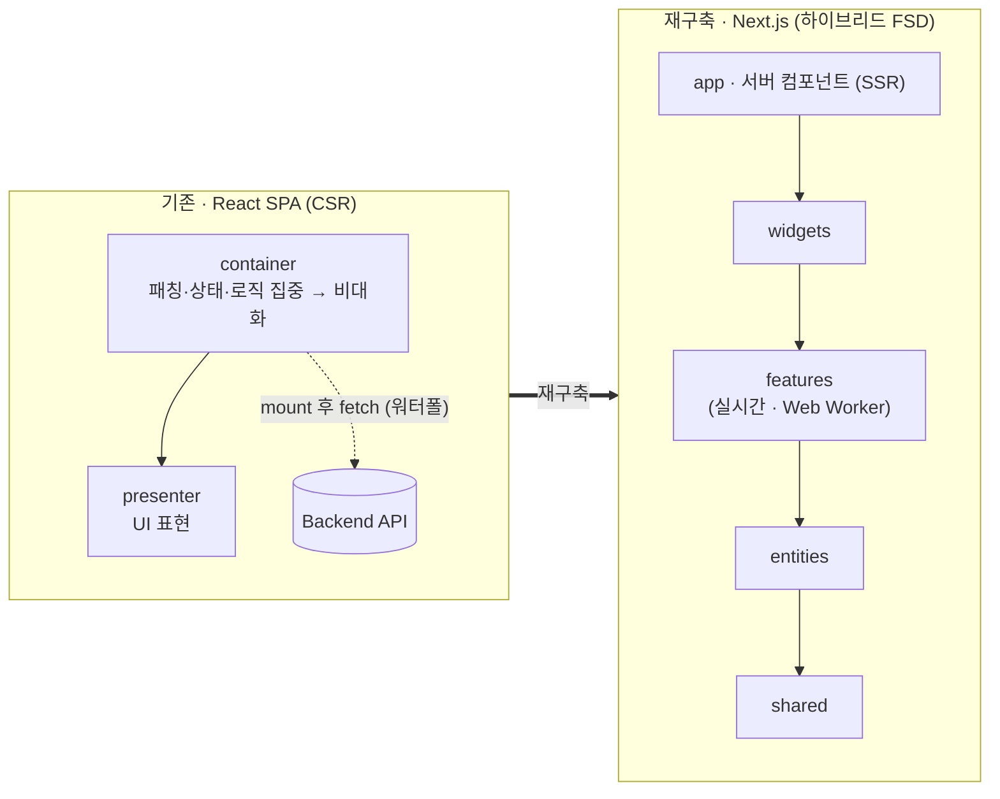
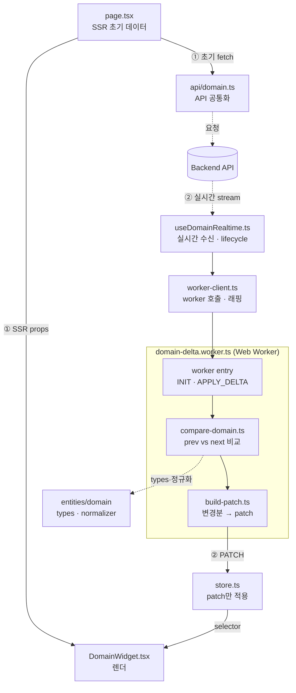

# ⚡ BEMS

**신규 개발 2023.08 – 2025.08 · 운영·리팩터링 2025.09 – 2026.07 · ㈜TSM Technology · 과장 · FE 개발 · 팀 리딩**

운영 지표 실시간 수집·시각화 및 계층형 조회·집계 시스템에서, 상태·캐시·실시간·렌더링·품질 기준을 하나의 운영 구조로 연결하고, 클라이언트 최적화의 한계를 수치로 확인한 뒤 Next.js SSR로 아키텍처를 일괄 재구축했습니다.

## 기술 스택

`Next.js` `React` `TypeScript` `Zustand` `TanStack Query` `BFF` `Web Worker` `DevExtreme` `Vitest` `Playwright` `Storybook` `SonarQube`

---

## 성과 요약

| 항목 | 문제 | 적용 | 결과 |
|---|---|---|---|
| 상태·캐시 구조 | 동일 데이터를 여러 페이지에서 반복 요청 | Zustand·TanStack Query·BFF로 상태 소유권과 캐시 경계 분리 | 동일 플로우 네트워크 요청 **30% 이상 감소** |
| 실시간 처리 | 1분 단위 데이터 전환 시 네트워크와 메인 스레드 병목 발생 | Delta Update + Web Worker 분리 | 네트워크 전송량 **약 60% 감소**, 화면 반영 **3~5초 → 2초** |
| 아키텍처 한계 | 클라이언트 최적화만으로는 더 이상 반영 속도를 줄일 수 없음 | 점진 개선 대신 Next.js SSR로 아키텍처 일괄 재구축 | API 오버페칭 제거, 화면 반영 **2초 → 1초 (40% 이상 개선)** |
| 크로스 브라우징 | Worker 반영 이후 Grid·Chart 잘림, 이미지 미노출, 이중 스크롤 발생 | `requestAnimationFrame`, `ResizeObserver`, 레이아웃 보정 | Chrome·Edge·Safari·Firefox 동작 일관성 확보 |
| 품질 검증 | 동일 기준 UAT 품질 이슈가 반복적으로 발생 | SonarQube, AI Reviewer, Vitest, Playwright, Storybook, UAT 연결 | UAT 품질 이슈 **500건 → 50건** |
| 협업 기준 | 요구사항·검증 기준·변경 이력이 맞지 않아 재작업 발생 | 요구사항 문서화, 검증 결과 기록, 변경 이력 관리 | 정기 협의 회의 **주 3회 → 1회** |
| 인증 보안 | 외부 SP가 SAML 요청-응답 상관관계(UUID)를 검증하지 않아 인증 위조 가능성 존재 | FE-BE 간 별도 state 토큰을 httpOnly 쿠키로 발급·대조하는 검증 계층 추가 | 요청-응답 상관관계 검증 확보, **약 3주 내** 대응 완료 |

---

## 맡은 역할

- 서비스 설계 · 프론트엔드 구현 · 클라이언트 커뮤니케이션 · 일정 조율 주도
- 상태·캐시·실시간·품질을 개별 최적화가 아닌 하나의 운영 구조로 연결
- 요구사항·검증 기준 문서화로 팀 공통 논의 기준 확보

---

## 핵심 문제 — 여러 층에서 동시에 터진 병목

기능 추가보다, 늘어나는 데이터·요구사항 속에서 실시간 서비스의 성능과 정합성을 유지하는 것이 핵심 과제였습니다.

- 서버 데이터와 UI 상태 혼재 → 불필요한 리렌더링
- 동일 API를 여러 페이지에서 반복 호출
- 1분 단위 전환 후 비교·갱신 연산이 메인 스레드 점유
- Worker 결과의 비동기 반영 → Grid·Chart·이미지·스크롤이 브라우저마다 깨짐
- 요구사항·검증 결과·변경 이력 불일치 → 품질 이슈·재작업 누적

---

## 1. 상태·캐시 소유권 분리 — 네트워크 요청 30% 이상 감소

서버 데이터와 UI 상태를 한 덩어리로 두지 않고 소유권을 분리해, 동일 데이터의 페이지 간 재요청을 없앴습니다.

- **문제** — 상태 혼재로 변경 범위가 불명확하고 같은 데이터를 여러 화면에서 다시 조회
- **적용** — Zustand(UI 상태) / TanStack Query(서버 데이터·캐싱·리페치) 분리, 공통 Query Key로 페이지 간 재사용, BFF에 인증·사용자별 서버 캐시 위임
- **성과** — 동일 사용자 플로우 네트워크 요청 30% 이상 감소, 새로고침·토큰 갱신 시 Origin 재호출 방지

```ts title="domain.ts"
// 설명용 예시: 실제 Store·Query 이름이 아님
const 도메인스토어 = create<{
  선택값: string | null
  선택값설정: (id: string) => void
}>((set) => ({
  선택값: null,
  선택값설정: (id) => set({ 선택값: id }),
}))

export const 도메인키 = {
  detail: (id: string) => ['domain', 'detail', id] as const,
}
```

```ts title="domain.ts"
// 설명용 예시: 실제 캐시 구현·Key가 아님
export async function 데이터조회(사용자ID, 대상ID) {
  const 캐시키 = "사용자·대상 기준 캐시 키 생성"
  const 캐시값 = await cache.get(캐시키)

  if (캐시값) "캐시된 값 즉시 반환"

  const 원본데이터 = await requestOrigin(대상ID)
  await cache.set(캐시키, 원본데이터, "TTL 설정")

  return 원본데이터
}
```

---

## 2. Delta Update·Web Worker — 전송량 60%↓, 반영 3~5초→2초

15분 주기를 1분 단위로 바꾸는 요구에 대응하기 위해, 변경분만 주고받고 무거운 연산을 메인 스레드 밖으로 옮겼습니다.

- **문제** — 1분 단위 전면 수신 시 전송량 급증, 4,400개 비교·캐싱 연산이 메인 스레드를 점유해 UI 블로킹
- **적용** — 이전 결과 캐싱 후 변경분만 갱신하는 Delta Update, 시간·컬럼 단위 비교로 시계열 오염 방지, 비교·검증을 Web Worker로 분리, `performance.now()`·`requestAnimationFrame()`으로 수신·반영 시점 측정
- **성과** — 네트워크 전송량 약 60% 감소, 화면 반영 3~5초 → 2초, 메인 스레드 점유 최소화

여기까지가 **클라이언트 최적화의 한계**였고, 초기 조회·렌더링이 브라우저에 남아 있는 한 2초 아래로는 내려가지 않아 이후 아키텍처 재구축(4번)의 출발점이 됐습니다.

```ts title="domain.ts"
// 설명용 예시: 실제 Worker 메시지와 데이터 구조가 아님
self.onmessage = ({ data }) => {
  const 변경목록 = data.next.filter((항목) => "이전 값과 비교해 변경된 항목만 추출")

  self.postMessage({ changed: 변경목록 })
}
```

```ts title="domain.ts"
// 설명용 예시: 실제 React 상태 갱신 코드가 아님
worker.onmessage = ({ data }) => {
  setRows((현재값) => 행병합(현재값, data.changed))

  requestAnimationFrame(() => {
    grid.updateDimensions()
  })
}
```

---

## 3. 크로스 브라우징 렌더링 정리 — 4개 브라우저 UI 동작 일관성 확보

비동기 데이터 반영과 레이아웃 재계산 시점이 엇갈리면서 브라우저마다 깨지던 렌더링을, React 상태 반영 직후 다음 프레임으로 후속 계산 시점을 미루는 방식으로 정리했습니다.

- **문제** — 비동기 데이터 반영과 레이아웃 재계산 시점이 엇갈려 Grid·Chart·이미지가 DOM 크기 확정 전에 측정·렌더되고, 브라우저별 레이아웃·페인트 타이밍 차이로 Grid·Chart 잘림, 이미지 미노출, 이중 스크롤, Resize 이후에만 정상 표시
- **적용** — React 상태 반영 직후 `requestAnimationFrame`으로 후속 계산을 다음 프레임으로 예약하고, `ResizeObserver`로 컨테이너 크기 변경을 감지해 Grid·Chart 레이아웃을 재계산 — 측정·재계산 시점을 레이아웃 확정 이후로 맞춤
- **성과** — Chrome·Edge·Safari·Firefox에서 Grid·Chart·이미지·스크롤 동작 일관성 확보

```ts title="domain.ts"
// 설명용 예시: 실제 Grid·Chart API와 변수명이 아님
useLayoutEffect(() => {
  const 대상요소 = containerRef.current
  if (!대상요소) return

  const observer = new ResizeObserver(() => {
    requestAnimationFrame(() => {
      grid.updateDimensions()
      chart.resize()
    })
  })

  observer.observe(대상요소)
  return () => observer.disconnect()
}, [])
```

컨테이너 관찰은 `useLayoutEffect`로 첫 페인트 전에 연결하고, 크기 변경 시 `ResizeObserver`(감지) → `requestAnimationFrame`(다음 프레임 예약) → 재계산 순서로 측정·재계산 타이밍을 레이아웃 확정 이후로 안정화했습니다.

---

## 4. React.js → Next.js 재구축 — Container-Presenter에서 하이브리드 FSD로, 화면 반영 2초→1초

남은 지연이 개별 코드가 아니라 CSR(React.js SPA) 구조 자체에서 나온다고 판단하고, 점진 개선 대신 Next.js App Router로 아키텍처를 일괄 재구축했습니다.

- **문제**
  - **구조** — 초기 React.js는 Container-Presenter 2계층으로 시작했는데, Container에 데이터 패칭·상태·비즈니스 로직이 몰리며 비대화되고 계층 간 중복 import가 누적
  - **성능** — 모든 화면이 CSR이라 `mount → fetch → 재렌더` 워터폴로 첫 화면이 늦음. 무거운 연산은 Web Worker로 메인 스레드 밖으로 뺐지만(→ 2번), 초기 조회·렌더가 브라우저에 남는 CSR 구조 자체의 첫 로드 지연은 그대로 남음
- **적용**
  - **하이브리드 FSD 이관** — Container-Presenter 2계층을 FSD 계층(`shared`·`entities`·`features`·`widgets`)으로 재편하고, Next.js App Router의 라우팅·서버 컴포넌트와 결합한 하이브리드 FSD로 구성. 데이터 패칭을 서버 컴포넌트/상위 계층으로 끌어올려 Container 비대화·중복 import 해소
  - **SSR** — 매 요청 달라지는 운영 화면은 초기 조회·렌더를 서버에서 확정해 CSR 워터폴 제거, 화면이 쓰는 데이터만 조회하도록 API 계약 재정의
  - **SSG** — 거의 변하지 않는 정적 페이지는 빌드 타임에 미리 생성해 초기 로드 비용 최소화
  - **역할 분리** — 초기 로드의 조회·렌더는 서버(SSR)로 옮기고, 로드 이후 1분 단위 실시간 갱신은 계속 Delta Update + Web Worker(→ 2번)가 담당하도록 경계를 나눔
  - **AI 하네스 기반 재구축** — 재구축 전 과정을 AI 하네스(표준 구현·검증 프로세스)로 진행해 구조 변경의 일관성을 확보하고, Lighthouse로 전환 전후 성능을 정량 비교
- **성과** — 전 페이지 화면 반영 2초 → 1초 이내(40% 이상 개선), 오버페칭 제거로 정합성 확보, 서버 렌더링으로 기기 성능 편차 해소, 팀 스택 Next.js 통일

**구조 비교** — 설명용 예시 구조이며 실제 폴더·파일 이름이 아닙니다.

**A. 고수준 비교 (React → Next.js)**



**B. 재구축 후 상세 흐름 (① 첫 로드 SSR → ② 로드 후 실시간 Worker)**



각 파일의 역할은 다음과 같습니다.

- **`page.tsx`** — 서버에서 초기 데이터를 fetch해 SSR로 확정하고, 위젯에 초기 props로 주입 (첫 로드 담당)
- **`domain.ts`** — 도메인 API 호출 공통화 (page의 초기 fetch가 사용)
- **`useDomainRealtime.ts`** — 실시간 데이터를 수신(stream 연결)하고 Web Worker의 생성·종료(lifecycle)를 관리
- **`worker-client.ts`** — `new Worker(...)`로 워커를 띄우고 메시지 송수신을 래핑해, 상위 코드가 워커 API를 직접 다루지 않도록 격리
- **`domain-delta.worker.ts`** — worker entry. `INIT`(기준 snapshot 설정)·`APPLY_DELTA` 메시지를 수신·응답
- **`compare-domain.ts`** — 이전값 vs 현재값을 비교해 변경된 row·item·field만 추출(순수 함수)
- **`build-patch.ts`** — 비교 결과를 store 반영용 patch로 변환(순수 함수)
- **`store.ts`·`selectors.ts`** — 워커가 보낸 patch만 적용하고, 위젯에 필요한 selector 제공
- **`types.ts`·`normalizer.ts`** — 도메인 타입과 원본 정규화 규칙을 정의. 정규화는 비교 전에 적용해 prev·next의 shape를 맞춤
- **`DomainWidget.tsx`** — 서버 초기 데이터와 실시간 상태를 받아 최종 렌더

**워커 메시지 흐름**

```text
초기 snapshot            → INIT (기준 snapshot 저장)
새 snapshot·delta 수신   → APPLY_DELTA
  → compare-domain.ts    : prev vs next 비교 → 변경분만 추출
  → build-patch.ts       : 변경분 → patch 변환
  → postMessage(PATCH)   → main thread store 반영
```

```ts title="domain.ts"
// 설명용 예시: 실제 타입 이름이 아님

// compare-domain.ts 의 비교 결과
type CompareResult = {
  added: Item[]
  updated: Item[]
  removed: string[]
}

// worker → main thread 응답 (build-patch.ts 결과)
type WorkerResponse = {
  type: 'PATCH'
  payload: {
    changedIds: string[]
    patch: DomainPatch
  }
}
```

핵심은 **비교 레이어를 없애지 않되 메인 스레드가 아니라 워커 내부 단계로 두고, `비교(compare)`와 `patch 생성(build-patch)`까지 분리**했다는 점입니다. store는 patch만 반영해 얇게 유지되고, FSD 의존은 항상 **상위 → 하위 단방향**(`app → widgets → features → entities → shared`)으로만 흐릅니다.

이 재구축의 의미는 속도 수치보다, **클라이언트 최적화의 한계를 수치로 확인한 뒤 프레임워크와 아키텍처 자체를 바꾸는 판단을 내렸다는 점**에 있습니다. 2초까지는 React.js 위에서 코드로 줄였고, 그 아래는 렌더링 구조를 서버로 옮겨야 닿는 구간이었습니다.

---

## 5. 품질 검증 체계화 — UAT 이슈 500건→50건

문제를 나중에 잡지 않고, 변경이 들어올 때 어떤 계층에서 무엇을 먼저 막을지 검증 흐름을 구조화했습니다.

- **문제** — 성능을 개선해도 동일 기준 UAT 품질 이슈가 반복
- **적용** — SonarQube(정적 분석), AI Reviewer(로직·보안·캐시 사전 점검), Vitest(함수·상태), Playwright(사용자 흐름), Storybook(UI 회귀), UAT(최종 확인)를 계층으로 연결
- **성과** — 동일 기준 UAT 품질 이슈 500건 → 50건 내외

---

## 6. 협업 기준 문서화 — 정기 회의 주3회→1회

요구사항과 검증 기준이 어긋나면 성능보다 커뮤니케이션 비용이 커지는 문제를, 기준 문서화로 줄였습니다.

- **문제** — 변경이 잦을수록 요구사항·검증 기준 불일치로 재작업 발생
- **적용** — 요구사항 문서화, 검증 결과 기록, 변경 이력 관리, 개발 컨벤션 정리
- **성과** — 정기 협의 회의 주 3회 → 1회, 반복 확인·오해로 인한 재작업 감소

---

## 7. SAML 요청-응답 검증 계층 — 인증 위조 방어선 확보

외부 SP가 검증하지 않는 SAML 요청-응답 상관관계를, 애플리케이션 레벨의 자체 state 토큰 대조로 보완했습니다.

- **문제** — 외부 제어 시스템 SP가 응답의 UUID(요청 상관관계)를 검증하지 않아, 정당한 요청 없이도 응답 위조로 접근 가능한 갭을 코드 분석으로 확인
- **적용** — SP 코드 수정 불가 상황에서 별도 검증 계층 추가: 로그인 시 BEMS 사용자 여부 선확인 → `random` state 값을 httpOnly 쿠키에 저장(SAML 왕복과 무관한 FE-BE 전용 채널) → IdP 인증 결과 수신 후 쿠키 state와 문자열 비교로 최종 로그인 결정 (OAuth state 파라미터와 동일 원리)
- **성과** — 외부 SP가 안 하는 요청-응답 바인딩을 자체 확보, httpOnly 쿠키로 state XSS 탈취 차단, 코드 분석부터 적용까지 약 3주 내 대응

```ts title="domain.ts"
// 설명용 예시: 실제 API·쿠키 이름이 아님

// 1. 사용자 확인 — 등록된 사용자인지 확인
export async function 로그인요청(사용자ID) {
  const 등록여부 = await 사용자확인(사용자ID)

  if (!등록여부) "미등록 사용자 오류로 종료"

  // 2. state 값 생성 후 httpOnly 쿠키에 저장
  "randomBytes 기반 state 값 생성"
  "httpOnly 쿠키에 저장"

  "IdP로 리다이렉트"
}

// 3. IdP 응답 이후 콜백에서 검증
export function 콜백검증(인증성공, 응답값) {
  const 저장값 = "쿠키에서 state 값 조회"
  return 인증성공 && "저장값과 응답값 일치 여부 비교"
}
```

---

BEMS는 성능만 올린 프로젝트가 아니라, 기능·품질·협업 기준을 함께 정리해 운영 가능한 프론트엔드 구조를 만든 프로젝트였습니다.
