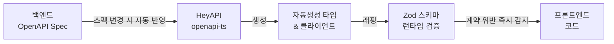

import Tabs from '@theme/Tabs';
import TabItem from '@theme/TabItem';

# 🏭 FMS

**2026.01 – 2026.06 · ㈜TSM Technology · 과장 · FE 개발 · 팀 리딩**

복합 업무 프로세스를 디지털화한 웹 애플리케이션.
<br/>설비 관리로 시작한 프로젝트가 ERP까지 확장되며 범위가 급격히 커졌고, 2인 체제로 그 변화를 감당해야 했습니다.
<br/>저는 이 문제를 개인 생산성에 의존하지 않고, 병렬 개발이 가능한 구조를 설계하는 방식으로 풀었습니다.

## 기술 스택

`Next.js` `React` `TypeScript` `Tailwind CSS` `Zustand` `TanStack Query` `Zod` `Design Tokens` `Vitest` `Playwright` `Storybook`

---

## 성과 요약

| 발견 항목 | 문제 | 개선 방향 | 결과 |
|---|---|---|---|
| 개발 병렬성 | 2인 체제로 전 도메인 커버 어려움 | VSA 구조 분리 + AI Workflow 표준화 | 설비·ERP 전 도메인 병렬 개발 |
| 타입 안정성 | 수동 타입 정의·백엔드 소통 비용 발생 | OpenAPI → Zod 타입 자동화 | 소통 비용 감소, 타입 불일치 버그 제거 |
| UI 기준 표준화 | 슬라이스별 UI·토큰 변경 기준이 불명확함 | shared UI·design-tokens 분리, Changesets 기준 명시 | 릴리즈 기준 표준화 |
| 프롬프트 오해 | 컨텍스트 누적으로 AI 재작업 반복 | 하네스 엔지니어링, 도메인별 reference 명세화 | 재작업 감소, 개발 사이클 단축 |

---

## 병렬 개발을 어떻게 만들었는가

FMS는 기획을 제외한 서비스 설계, 프론트엔드 구현, 미팅까지 담당한 프로젝트였습니다. 초기에는 설비 관리 단일 도메인으로 시작했지만, 진행 중 ERP 기능이 편입되며 짧은 기간 안에 다뤄야 할 화면과 흐름이 크게 늘어났습니다.

**문제**
2인 규모의 팀이 확장된 전 도메인을 6개월 안에 설계, 구현, 검증까지 병행해야 했습니다. 단순히 화면을 빨리 만드는 것보다, 범위가 넓어질수록 컨텍스트가 분산되고 구현 기준이 흔들리며 수정 비용이 빠르게 커지는 구조가 더 큰 문제였습니다.

**발견**
실제로 병목은 세 가지로 드러났습니다.

- 도메인이 늘어날수록 기능 단위 병렬 개발이 어렵고, 한 사람이 여러 영역을 오갈 때 컨텍스트 전환 비용이 커졌습니다.
- 백엔드 API 변경 때마다 타입을 수동으로 맞추느라 소통과 수정 비용이 반복됐습니다.
- 공통 UI와 작업 기준이 고정되어 있지 않아, 범위가 넓어질수록 구현 편차와 AI 재작업이 함께 증가했습니다.

**개선**
그래서 저는 개인 생산성을 끌어올리는 접근보다, 팀이 병렬로 움직일 수 있는 구조와 운영 방식을 함께 만드는 데 집중했습니다.

- 도메인 단위로 책임을 나눌 수 있도록 VSA 기반 구조를 적용했습니다.
- AI를 개인별 보조 도구가 아니라 팀 공통 작업 방식으로 표준화했습니다.
- OpenAPI → Zod 자동화로 API 계약 검증을 코드 생성과 런타임 검증까지 연결했습니다.
- `shared-ui`, `design-tokens`, Changesets 기준을 정리해 공통 표현 계층과 릴리즈 규칙을 고정했습니다.

**이유**
이 프로젝트에서 필요한 것은 "더 열심히 개발하는 것"이 아니라, 작은 팀이 커진 도메인을 감당할 수 있도록 구조와 기준을 먼저 세우는 일이었기 때문입니다. 그래야 사람이 바뀌거나 기능이 추가되어도 같은 방식으로 설계하고, 같은 기준으로 검증할 수 있었습니다.

**결과**
그 결과 2인 체제로도 설비·ERP 전 도메인 커버리지를 유지하면서 병렬 개발이 가능해졌고, 수동 타입 관리와 AI 재작업 비용을 줄인 상태로 6개월 일정의 프로젝트를 5개월 반 만에 완료할 수 있었습니다. 아래는 병렬 개발을 가능하게 만든 구조와 운영 방식입니다.

---

## 아키텍처 선택

도메인이 설비 관리에서 ERP까지 확장되자, 단순 Layered 구조로는 변경 범위와 컨텍스트 전환 비용이 빠르게 커질 수 있었습니다. 그래서 기능을 도메인 단위로 응집시키고 병렬 개발이 가능한 VSA를 선택했습니다.

이 선택 덕분에 작은 팀에서도 병렬 개발 기준을 유지하면서 확장된 도메인을 안정적으로 감당할 수 있었습니다. 구조 선택 이유와 폴더 구성은 [프로젝트별 아키텍처](../architecture/project-architecture.md) 문서에 정리했습니다.

---

## 핵심 개선

### 1. 병렬 개발 구조와 운영 방식

병렬 개발이 가능하려면 "무엇을 나눌 것인가"와 "어떻게 같은 기준으로 움직일 것인가"가 함께 정리되어야 했습니다. FMS에서는 이 두 문제를 각각 구조와 운영 방식으로 풀었습니다.

- **구조**: VSA로 도메인별 변경 범위를 슬라이스 안에 가두고, 공통 모듈 접근도 public API로 제한했습니다.
- **운영 방식**: AI 활용을 개인 재량에 맡기지 않고, 구현과 검증 기준이 고정된 팀 공통 워크플로우로 표준화했습니다.

이 두 축이 함께 있어야 기능을 나눠도 충돌이 줄고, 병렬로 작업해도 결과물 품질을 일정하게 유지할 수 있었습니다.

- 구조 선택 이유와 설계 방식은 [프로젝트별 아키텍처](../architecture/project-architecture.md) 문서에 정리했습니다.
- 운영 표준화 방식은 [AI Workflow](../ai-workflow/overview.md) 섹션에 정리했습니다.

### 2. 공통 SSR 인증/렌더링 구조

FMS는 여러 업무 도메인이 하나의 서비스 안에서 연결되어 있어, 인증 상태와 초기 진입 기준이 화면마다 달라지면 접근 제어와 초기 렌더링 품질이 함께 흔들릴 수 있었습니다. 그래서 서버 컴포넌트에서 인증을 먼저 판별하고, BFF 토큰 계층과 요청 단위 캐시 격리를 공통 패턴으로 적용했습니다.

핵심은 개별 화면 구현이 아니라, 도메인이 늘어나도 같은 인증·초기 렌더링 기준을 유지할 수 있는 공통 토대를 만든 것입니다. 상세 구조는 [SSR 인증/렌더링 구조](../architecture/ssr-auth-rendering.md) 문서에 정리했습니다.

### 3. OpenAPI → Zod 타입 자동화

백엔드 API가 바뀔 때마다 프론트에서 타입을 수동으로 맞추는 방식은, 도메인이 확장될수록 바로 병목이 됐습니다. 누락이 생기면 런타임에서야 문제를 발견했고, 그때마다 다시 백엔드와 스펙을 맞추는 비용이 반복됐습니다.

그래서 스펙 변경이 타입 생성과 런타임 검증까지 한 번에 연결되도록 OpenAPI → Zod 흐름을 만들었습니다. 핵심은 "타입을 잘 적는 것"이 아니라, 계약 위반을 늦게 발견하는 구조 자체를 없애는 것이었습니다.



```ts title="openapi-ts.config.ts"
export default defineConfig({
  input: 'http://api.internal/openapi.json',
  output: {
    path: 'src/shared/api/generated',
    format: 'prettier',
  },
  plugins: [
    '@hey-api/client-axios',
    '@hey-api/sdk',
    { name: '@hey-api/transformers', dates: true },
    'zod',
  ],
});
```

<Tabs>
  <TabItem value="generated" label="자동생성 타입">

```ts title="types.gen.ts"
export type Entity = {
  id: string;
  entityId: string;
  status: 'pending' | 'in_progress' | 'completed' | 'failed';
  scheduledAt: string;
  completedAt: string | null;
  assignee: { id: string; name: string };
};
```

  </TabItem>
  <TabItem value="zod-wrapper" label="Zod 런타임 검증">

```ts title="entity.schema.ts"
export const EntitySchema = z.object({
  id: z.string().uuid(),
  entityId: z.string().min(1),
  status: z.enum(['pending', 'in_progress', 'completed', 'failed']),
  scheduledAt: z.string().datetime(),
  completedAt: z.string().datetime().nullable(),
  assignee: z.object({ id: z.string(), name: z.string().min(1) }),
}) satisfies z.ZodType<Entity>;
```

  </TabItem>
  <TabItem value="usage" label="API 호출 시 검증">

```ts title="entityApi.ts"
export async function getEntityList(params: GetEntityListData) {
  const response = await client.getEntityList({ query: params.query });

  const validated = response.data.items.map((item) => {
    const result = EntitySchema.safeParse(item);
    if (!result.success) throw new Error(`API 스키마 불일치: ${result.error.message}`);
    return result.data;
  });

  return { items: validated, total: response.data.total };
}
```

  </TabItem>
</Tabs>

**결과**: 수동 타입 정의를 제거했고, API 계약 위반을 런타임에서 즉시 감지할 수 있게 되면서 백엔드 소통 비용과 타입 불일치 버그를 줄였습니다.

### 4. 공통 UI · 디자인 토큰 기준 정리

병렬 개발이 가능해져도, 공통 UI와 토큰 변경 기준이 없으면 결과물 품질은 다시 흔들릴 수 있습니다. 그래서 반복되는 UI 컴포넌트와 디자인 토큰만 공용 영역으로 분리하고, 비즈니스 로직은 각 슬라이스 내부에 남겨 두었습니다.

핵심은 공용화를 넓히는 것이 아니라, 표현 계층만 공통 기준으로 묶는 것이었습니다. 여기에 Changesets로 패키지별 major · minor · patch 기준까지 명시해, 공통 UI와 디자인 토큰이 어떻게 바뀌어야 하는지 팀이 같은 기준으로 판단할 수 있게 만들었습니다.
```
shared-ui/
  Button/
  Modal/
  DataTable/
  FormField/

design-tokens/
  colors.ts
  typography.ts
  spacing.ts
  radius.ts
```

```ts title="index.ts"
export const colors = {
  brand: {
    primary: "#5956E9",
    accent: "#A5A3F7",
    border: "#E0DAFF",
    tint: "#EDE9FF",
  },
  surface: {
    card: "#FFFFFF",
    page: "#FAFAFA",
    border: "#E5E7EB",
  },
  content: {
    primary: "#111827",
    secondary: "#374151",
    muted: "#6B7280",
  },
  status: {
    danger: "#EF4444",
    success: "#16A34A",
    warning: "#F59E0B",
  },
} as const;

export const radii = {
  sm: "0.375rem",
  md: "0.5rem",
  lg: "0.75rem",
  full: "999px",
} as const;

export const shadows = {
  sm: "0 1px 4px rgba(89,86,233,0.10)",
  md: "0 2px 12px rgba(89,86,233,0.12)",
  lg: "0 8px 32px rgba(89,86,233,0.20)",
} as const;
```
