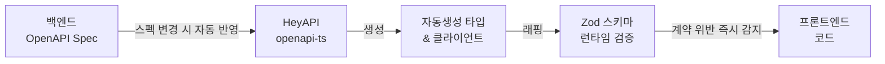

import Tabs from '@theme/Tabs';
import TabItem from '@theme/TabItem';

# FMS

**2026.01 – 2026.06 · ㈜TSM Technology · 과장 · FE 개발 · 팀 리딩**

복합 업무 프로세스를 디지털화한 웹 애플리케이션.
<br/>AI Agent 파이프라인으로 2인 체제에서도 전 도메인 커버리지를 유지하고 개발 속도를 향상시켰습니다.

## 기술 스택

`Next.js` `React` `TypeScript` `Tailwind CSS` `Zustand` `TanStack Query` `Zod` `Vitest` `Playwright` `Storybook`

---

## 성과 요약

| 발견 항목 | 문제 | 개선 방향 | 결과 |
|---|---|---|---|
| 개발 병렬성 | 2인 체제로 전 도메인 커버 어려움 | VSA 기반 Agent 도메인 독립 할당 | 30+ 라우트 전 도메인 병렬 개발 |
| 타입 안정성 | 수동 타입 정의·백엔드 소통 비용 발생 | OpenAPI → Zod 타입 자동화 | 소통 비용 감소, 타입 불일치 버그 제거 |
| 프롬프트 오해 | 컨텍스트 누적으로 AI 재작업 반복 | 하네스 엔지니어링, 도메인별 reference 명세화 | 재작업 감소, 개발 사이클 단축 |

---

## AI Agent

### 1. OpenAPI → Zod 타입 자동화

백엔드 API가 변경될 때마다 프론트엔드에서 타입을 수동으로 업데이트해야 했습니다. 누락이 잦았고, 런타임에서야 타입 불일치 버그를 발견하는 경우가 반복되었습니다.



```ts title="openapi-ts.config.ts"
export default defineConfig({
  input: 'http://api.internal/openapi.json',
  output: {
    path: 'src/shared/api/generated',
    format: 'prettier',
  },
  plugins: [
    '@hey-api/client-axios',
    '@hey-api/sdk',
    { name: '@hey-api/transformers', dates: true },
    'zod',
  ],
});
```

<Tabs>
  <TabItem value="generated" label="자동생성 타입">

```ts title="types.gen.ts"
export type Entity = {
  id: string;
  entityId: string;
  status: 'pending' | 'in_progress' | 'completed' | 'failed';
  scheduledAt: string;
  completedAt: string | null;
  assignee: { id: string; name: string };
};
```

  </TabItem>
  <TabItem value="zod-wrapper" label="Zod 런타임 검증">

```ts title="entity.schema.ts"
export const EntitySchema = z.object({
  id: z.string().uuid(),
  entityId: z.string().min(1),
  status: z.enum(['pending', 'in_progress', 'completed', 'failed']),
  scheduledAt: z.string().datetime(),
  completedAt: z.string().datetime().nullable(),
  assignee: z.object({ id: z.string(), name: z.string().min(1) }),
}) satisfies z.ZodType<Entity>;
```

  </TabItem>
  <TabItem value="usage" label="API 호출 시 검증">

```ts title="entityApi.ts"
export async function getEntityList(params: GetEntityListData) {
  const response = await client.getEntityList({ query: params.query });

  const validated = response.data.items.map((item) => {
    const result = EntitySchema.safeParse(item);
    if (!result.success) throw new Error(`API 스키마 불일치: ${result.error.message}`);
    return result.data;
  });

  return { items: validated, total: response.data.total };
}
```

  </TabItem>
</Tabs>

**결과**: 수동 타입 정의 제거, Zod 런타임 검증으로 API 계약 위반 즉시 감지, 백엔드 소통 비용 및 타입 불일치 버그 감소

### 2. UI · 디자인 토큰 패키지 분리

```
apps/
  web/          ← 메인 서비스
packages/
  ui/           ← 공용 컴포넌트
  design-tokens/← 색상·타이포·간격 토큰
```

Changesets로 major · minor · patch 기준 수립, 패키지 버전 독립 관리.
