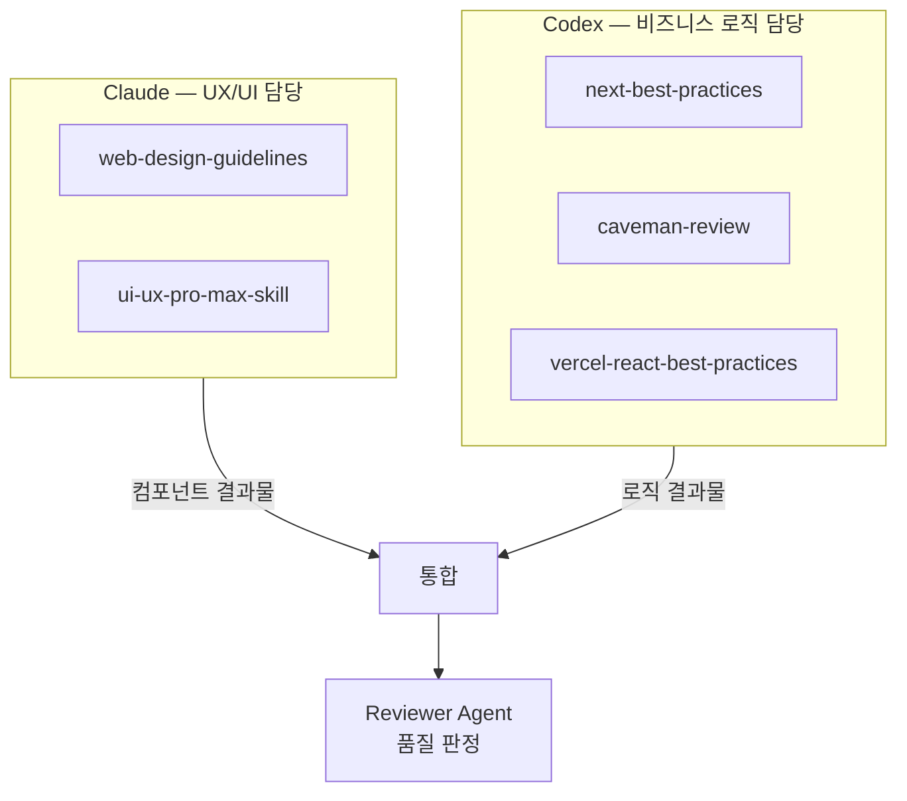
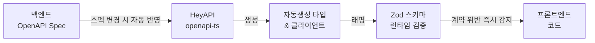

import Tabs from '@theme/Tabs';
import TabItem from '@theme/TabItem';

# FMS — Facility Management System

**2026.01 – 2026.06 · ㈜TSM Technology · 과장 · FE 개발 · 팀 리딩**

:::info 개요
시설물 유지보수 업무를 디지털화한 웹 애플리케이션.
AI Agent 파이프라인으로 2인 체제에서도 전 도메인 커버리지를 유지하고 개발 속도를 향상시켰습니다.
:::

## 기술 스택

`Next.js` `React` `TypeScript` `Tailwind CSS` `Zustand` `TanStack Query` `Zod` `Vitest` `Playwright` `Storybook`

---

## 성과 요약

| 발견 항목 | 문제 | 개선 방향 | 결과 |
|---|---|---|---|
| 개발 병렬성 | 2인 체제로 전 도메인 커버 어려움 | VSA 기반 Agent 도메인 독립 할당 | 30+ 라우트 전 도메인 병렬 개발 |
| 타입 안정성 | 수동 타입 정의·백엔드 소통 비용 발생 | OpenAPI → Zod 타입 자동화 | 소통 비용 감소, 타입 불일치 버그 제거 |
| 품질 커버리지 | 수동 검증으로 누락 위험 | Vitest + Playwright + Storybook 3중 검증 | 단위·E2E·UI 전 레이어 커버리지 확보 |
| 프롬프트 오해 | 컨텍스트 누적으로 AI 재작업 반복 | 하네스 엔지니어링, 도메인별 reference 명세화 | 재작업 감소, 개발 사이클 단축 |

---

## AI Agent

Claude(UX/UI) + Codex(비즈니스 로직) 역할 분리, 구현·검증·리뷰·배포 4단계 파이프라인 운영.

→ 자세한 내용: [4단계 파이프라인](/ai-workflow/agent-pipeline)

### Agent 역할 분리 구조



**Claude — UX/UI 담당**

| Skill | 역할 |
|---|---|
| `web-design-guidelines` | 디자인 시스템 기준 참조, Tailwind 클래스 선택 기준 |
| `ui-ux-pro-max-skill` | 고품질 UI 컴포넌트·레이아웃 구현 기준 |

담당 영역: 컴포넌트 구조·레이아웃, Tailwind CSS 클래스 선택, 접근성(a11y), 반응형 디자인, 애니메이션·트랜지션

**Codex — 비즈니스 로직 담당**

| Skill | 역할 |
|---|---|
| `next-best-practices` | Next.js Route Handler, Server Component, App Router 패턴 |
| `caveman-review` | 코드 품질 판정 (Critical/Major/Minor 심각도) |
| `vercel-react-best-practices` | TanStack Query, Zustand, React 패턴 구현 |

담당 영역: API Route Handler(BFF 패턴), TanStack Query 훅, Zustand 스토어, Zod 스키마 검증, 도메인 로직·유틸

**역할 분리 효과**

단일 Agent에게 요청하면 UI 스타일과 비즈니스 로직이 하나의 컴포넌트에 뒤섞여 수정 시 서로 영향을 줬습니다. 역할 분리 후 Claude는 UI만, Codex는 로직만 담당해 각자의 수정이 상대 영역에 영향을 주지 않으며, 하네스 엔지니어링 도입 후 Agent 정확도 95% 달성했습니다.

### 1. OpenAPI → Zod 타입 자동화

백엔드 API가 변경될 때마다 프론트엔드에서 타입을 수동으로 업데이트해야 했습니다. 누락이 잦았고, 런타임에서야 타입 불일치 버그를 발견하는 경우가 반복되었습니다.



```ts title="openapi-ts.config.ts"
export default defineConfig({
  input: 'http://api.internal/openapi.json',
  output: {
    path: 'src/shared/api/generated',
    format: 'prettier',
  },
  plugins: [
    '@hey-api/client-axios',
    '@hey-api/sdk',
    { name: '@hey-api/transformers', dates: true },
    'zod',
  ],
});
```

<Tabs>
  <TabItem value="generated" label="자동생성 타입">

```ts title="src/shared/api/generated/types.gen.ts"
export type Inspection = {
  id: string;
  facilityId: string;
  status: 'pending' | 'in_progress' | 'completed' | 'failed';
  scheduledAt: string;
  completedAt: string | null;
  inspector: { id: string; name: string };
};
```

  </TabItem>
  <TabItem value="zod-wrapper" label="Zod 런타임 검증">

```ts title="features/inspection/model/inspection.schema.ts"
export const InspectionSchema = z.object({
  id: z.string().uuid(),
  facilityId: z.string().min(1),
  status: z.enum(['pending', 'in_progress', 'completed', 'failed']),
  scheduledAt: z.string().datetime(),
  completedAt: z.string().datetime().nullable(),
  inspector: z.object({ id: z.string(), name: z.string().min(1) }),
}) satisfies z.ZodType<Inspection>;
```

  </TabItem>
  <TabItem value="usage" label="API 호출 시 검증">

```ts title="features/inspection/api/inspectionApi.ts"
export async function getInspectionList(params: GetInspectionListData) {
  const response = await client.getInspectionList({ query: params.query });

  const validated = response.data.items.map((item) => {
    const result = InspectionSchema.safeParse(item);
    if (!result.success) throw new Error(`API 스키마 불일치: ${result.error.message}`);
    return result.data;
  });

  return { items: validated, total: response.data.total };
}
```

  </TabItem>
</Tabs>

**결과**: 수동 타입 정의 제거, Zod 런타임 검증으로 API 계약 위반 즉시 감지, 백엔드 소통 비용 및 타입 불일치 버그 감소

### 2. 품질 검증 (Merge Gate)

Critical/Major/Minor 심각도 판정 기반 병합 차단 + Vitest · Playwright 3중 검증.

→ 자세한 내용: [Merge Gate (CI)](/quality/merge-gate-ci)

### 3. UI · 디자인 토큰 패키지 분리

```
apps/
  web/          ← 메인 서비스
packages/
  ui/           ← 공용 컴포넌트
  design-tokens/← 색상·타이포·간격 토큰
```

Changesets로 major · minor · patch 기준 수립, 패키지 버전 독립 관리.
