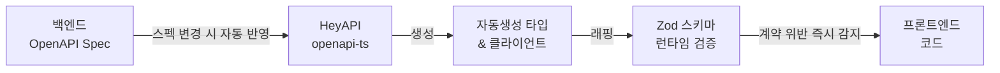

import Tabs from '@theme/Tabs';
import TabItem from '@theme/TabItem';

# 🏭 FMS

**2026.01 – 2026.06 · ㈜TSM Technology · 과장 · FE 개발 · 팀 리딩**

복합 업무 프로세스를 디지털화한 웹 애플리케이션.
<br/>AI Agent 파이프라인으로 2인 체제에서도 전 도메인 커버리지를 유지하고 개발 속도를 향상시켰습니다.

## 기술 스택

`Next.js` `React` `TypeScript` `Tailwind CSS` `Zustand` `TanStack Query` `Zod` `Design Tokens` `Vitest` `Playwright` `Storybook`

---

## 성과 요약

| 발견 항목 | 문제 | 개선 방향 | 결과 |
|---|---|---|---|
| 개발 병렬성 | 2인 체제로 전 도메인 커버 어려움 | VSA 기반 Agent 도메인 독립 할당 | 설비·ERP 전 도메인 병렬 개발 |
| 타입 안정성 | 수동 타입 정의·백엔드 소통 비용 발생 | OpenAPI → Zod 타입 자동화 | 소통 비용 감소, 타입 불일치 버그 제거 |
| UI 기준 표준화 | 슬라이스별 UI·토큰 변경 기준이 불명확함 | shared UI·design-tokens 분리, Changesets 기준 명시 | 릴리즈 기준 표준화 |
| 프롬프트 오해 | 컨텍스트 누적으로 AI 재작업 반복 | 하네스 엔지니어링, 도메인별 reference 명세화 | 재작업 감소, 개발 사이클 단축 |

---

## 팀 리딩 — AI 워크플로우로 2인 팀을 확장하다

FMS는 기획을 제외한 서비스 설계, 프론트엔드 구현, 미팅까지 담당한 프로젝트였습니다. 초기에는 설비 관리 단일 도메인으로 시작했으나, 이후 ERP 도메인이 서비스에 편입되면서 운영 범위가 크게 확장되었습니다.

프로젝트를 진행하며 가장 큰 과제는 인력 대비 넓은 개발 범위였습니다. 2인 규모의 팀이 확장된 도메인 전반을 6개월 내에 설계, 구현, 검증까지 병행해야 했고, 기존 개발 방식만으로는 일정과 품질을 동시에 확보하기 어려운 상황이었습니다.

이를 해결하기 위해 AI 기반 개발 워크플로우를 도입했습니다. 개인별로 AI를 활용하는 방식이 아니라, 팀 전체가 동일한 기준으로 활용할 수 있도록 표준화하는 데 중점을 두었습니다.

- **아키텍처 설계** — AI 워크플로우를 하네스 + 온톨로지 구조로 설계했습니다.
- **사용 기준 정립** — AI를 활용하는 시점과 방식을 구현·검증·리팩토링 세 단계로 분류하여 문서화했습니다.
- **팀 배포** — 정리한 지침을 팀원별 문서로 배포하여 동일한 기준으로 개발할 수 있는 환경을 구축했습니다.

그 결과 2인 규모의 팀으로 확장된 전 도메인을 커버하면서, 6개월 일정의 프로젝트를 5개월 반 만에 완료할 수 있었습니다. 해당 워크플로우의 상세 구조는 [AI Workflow](../ai-workflow/overview.md) 섹션에 정리했습니다.

---

## SSR 인증/렌더링
FMS는 여러 업무 도메인이 얽혀 있어, 인증과 초기 렌더링을 서버에서 먼저 판단하는 구조가 특히 중요했습니다. 그래서 서버 컴포넌트 인증 판별, BFF 토큰 계층, 요청 단위 캐시 격리 같은 패턴을 공통으로 적용했습니다. 이 과정을 [SSR 인증/렌더링 구조](../architecture/ssr-auth-rendering.md)에 따로 정리해 두었으니, 함께 봐주시면 감사하겠습니다.


---

## AI Agent

### 1. OpenAPI → Zod 타입 자동화

2명이 설비부터 ERP까지 넓은 범위를 쳐내는 상황에서, 백엔드 API가 바뀔 때마다 타입을 손으로 맞추는 비용은 감당할 수 없었습니다. 누락이 잦았고 런타임에서야 타입 불일치를 발견하는 일이 반복됐습니다. 그래서 이 소통·수정 비용을 자동화로 아예 없앴습니다.



```ts title="openapi-ts.config.ts"
export default defineConfig({
  input: 'http://api.internal/openapi.json',
  output: {
    path: 'src/shared/api/generated',
    format: 'prettier',
  },
  plugins: [
    '@hey-api/client-axios',
    '@hey-api/sdk',
    { name: '@hey-api/transformers', dates: true },
    'zod',
  ],
});
```

<Tabs>
  <TabItem value="generated" label="자동생성 타입">

```ts title="types.gen.ts"
export type Entity = {
  id: string;
  entityId: string;
  status: 'pending' | 'in_progress' | 'completed' | 'failed';
  scheduledAt: string;
  completedAt: string | null;
  assignee: { id: string; name: string };
};
```

  </TabItem>
  <TabItem value="zod-wrapper" label="Zod 런타임 검증">

```ts title="entity.schema.ts"
export const EntitySchema = z.object({
  id: z.string().uuid(),
  entityId: z.string().min(1),
  status: z.enum(['pending', 'in_progress', 'completed', 'failed']),
  scheduledAt: z.string().datetime(),
  completedAt: z.string().datetime().nullable(),
  assignee: z.object({ id: z.string(), name: z.string().min(1) }),
}) satisfies z.ZodType<Entity>;
```

  </TabItem>
  <TabItem value="usage" label="API 호출 시 검증">

```ts title="entityApi.ts"
export async function getEntityList(params: GetEntityListData) {
  const response = await client.getEntityList({ query: params.query });

  const validated = response.data.items.map((item) => {
    const result = EntitySchema.safeParse(item);
    if (!result.success) throw new Error(`API 스키마 불일치: ${result.error.message}`);
    return result.data;
  });

  return { items: validated, total: response.data.total };
}
```

  </TabItem>
</Tabs>

**결과**: 수동 타입 정의 제거, Zod 런타임 검증으로 API 계약 위반 즉시 감지, 백엔드 소통 비용 및 타입 불일치 버그 감소

### 2. VSA 기반 UI · 디자인 토큰 분리

혼자 여러 도메인을 오가며 개발하다 보면 같은 성격의 UI가 화면마다 제각각으로 갈라지기 쉬웠고, 범위가 설비에서 ERP로 넓어질수록 그 편차는 더 커질 수밖에 없었습니다. 그래서 여러 슬라이스에서 반복되는 UI 컴포넌트와 디자인 토큰만 공용 영역으로 분리했습니다.
기능별 비즈니스 로직은 슬라이스 내부에 두고, `shared-ui`와 `design-tokens`에는 도메인 의존성이 없는 표현 계층만 배치했습니다.
Changesets로 패키지별 major · minor · patch 변경 기준을 명시하고, 공용 UI와 디자인 토큰의 릴리즈 기준을 표준화했습니다.
```
shared-ui/
  Button/
  Modal/
  DataTable/
  FormField/

design-tokens/
  colors.ts
  typography.ts
  spacing.ts
  radius.ts
```

```ts title="index.ts"
export const colors = {
  brand: {
    primary: "#5956E9",
    accent: "#A5A3F7",
    border: "#E0DAFF",
    tint: "#EDE9FF",
  },
  surface: {
    card: "#FFFFFF",
    page: "#FAFAFA",
    border: "#E5E7EB",
  },
  content: {
    primary: "#111827",
    secondary: "#374151",
    muted: "#6B7280",
  },
  status: {
    danger: "#EF4444",
    success: "#16A34A",
    warning: "#F59E0B",
  },
} as const;

export const radii = {
  sm: "0.375rem",
  md: "0.5rem",
  lg: "0.75rem",
  full: "999px",
} as const;

export const shadows = {
  sm: "0 1px 4px rgba(89,86,233,0.10)",
  md: "0 2px 12px rgba(89,86,233,0.12)",
  lg: "0 8px 32px rgba(89,86,233,0.20)",
} as const;
```
