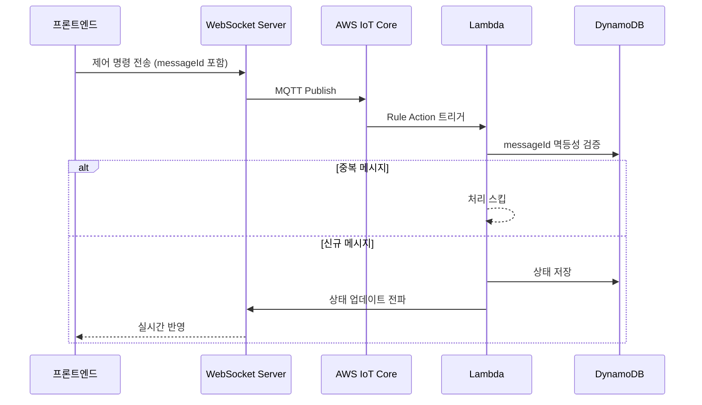

# 공조기 자동제어 및 모니터링

**2024.08 – 2025.12 · ㈜TSM Technology · 과장 · FE 개발 · AWS 서버 구축**

:::info 개요
AWS IoT Core 기반 공조기 장비 원격 제어 및 실시간 모니터링 시스템.
MQTT·WebSocket 기반 제어 흐름 정리로 제어 응답 지연 40% 감소.
CloudWatch Alarm 연동으로 장애 대응 체계 확보.
:::

## 기술 스택

`React` `Node.js` `TypeScript` `Redux` `SSE` `WebSocket` `AWS IoT Core` `Lambda` `DynamoDB` `S3` `Athena`

---

## 성과 요약

| 지표 | Before | After |
|---|---|---|
| 제어 응답 지연 | 23초 | **1초 이내** |
| 실시간 메시지 전송 | 중복 포함 | 중복 필터링으로 **40% 감소** |
| 초기 구동 시간 | 기준 | 우선 mount 처리로 **30% 개선** |

---

## 시스템 아키텍처



→ 자세한 내용: [AWS IoT 제어 흐름](/realtime/aws-iot-control) · [멱등성 검증](/realtime/dedup-idempotency)

---

## 주요 구현

### 1. 아키텍처 전환 (Layered → VSA)

Layered Architecture의 수정 영향 범위 문제 → Vertical Slice Architecture 전환으로 40% 축소.

→ 자세한 내용: [Layered → VSA 전환](/architecture/layered-to-vsa)

### 2. 핵심 데이터 우선 mount

```tsx title="HvacDashboard.tsx"
export function HvacDashboard() {
  return (
    <>
      {/* 1순위: 제어 상태 패널 — 즉시 mount */}
      <Suspense fallback={<ControlPanelSkeleton />}>
        <ControlPanel />
      </Suspense>

      {/* 2순위: 모니터링 차트 — 지연 로드 */}
      <Suspense fallback={<ChartSkeleton />}>
        <MonitoringChart />
      </Suspense>

      {/* 3순위: 이력 테이블 — lazy import */}
      <Suspense fallback={<TableSkeleton />}>
        <HistoryTable />
      </Suspense>
    </>
  );
}
```

### 3. S3 + Athena 로그 분석 환경

```
IoT Core → Lambda → S3 (Parquet 포맷)
                 ↓
              Athena (SQL 쿼리)
                 ↓
         시간대별 요청 패턴 분석
         중복 이벤트 구간 분석
```

### 4. CloudWatch Alarm 연동

Lambda 오류율·처리 지연 임계값 설정 → SNS 알림으로 장애 즉시 감지.

---

## Issue & Resolution

:::danger 문제
제어 명령 전송 후 화면 반영까지 23초 지연.
:::

**원인**: 동일 제어 메시지 중복 전달 → Lambda 중복 처리 및 DB 중복 저장 발생.

**해결**: 메시지 ID 기반 멱등성 검증으로 중복 처리 제거. 프론트는 이벤트 ID 기준 중복 렌더링 필터링.

:::tip 결과
제어 지연 1초 이내 단축, DB 비용 절감, 오류율 20%+ 감소.
:::
