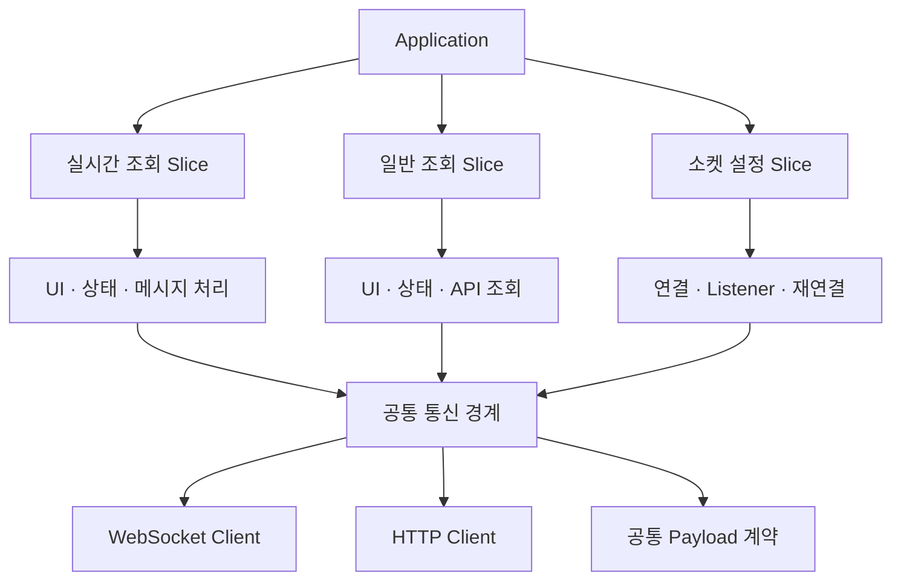

# 🤖 원격 제어 및 모니터링

**2025.08 – 2025.12 · ㈜TSM Technology · 과장 · FE 개발 · AWS 서버 구축**

AWS IoT Core 기반 현장 장비 원격 제어·실시간 모니터링 시스템에서, 중복 메시지·소켓 재생성·Listener 누수·장애 추적 부재를 데이터 처리·연결 생명주기·기능 구조·운영 관측 관점으로 정리했습니다.

## 기술 스택

`React` `Node.js` `TypeScript` `Redux` `SSE` `WebSocket` `AWS IoT Core` `Lambda` `DynamoDB` `S3` `Athena` `CloudWatch`

---

## 성과 요약

| 항목 | 문제 | 적용 | 결과 |
|---|---|---|---|
| MQTT 멱등성 | 동일 메시지가 반복 저장되어 제어 지연 누적 | Lambda 중간 계층 + `messageId` 기준 멱등성 검증 | 제어 지연 **10초+ → 1초 이내** |
| WebSocket 연결 구조 | 화면마다 소켓과 Listener를 개별 생성 | 공통 소켓 모듈과 연결 상태 관리 일원화 | 소켓 생성 지점 **3개 → 1개**, **67% 축소** |
| 메시지 수신 안정성 | 중복 구독과 잘못된 cleanup으로 메시지 누락 발생 | 화면 단위 등록·해제 기준 정리 | 수신 성공률 **15% → 100%** |
| 구조 분리 | 실시간·일반 조회·소켓 로직이 전역에 분산돼 기능 변경 시 여러 계층 동시 수정 | 기능 단위 Slice로 분리하는 VSA 구조 전환 | 수정 영향 범위 **약 40% 감소** |
| 운영 관측 | 장애 발생 후 원인 추적이 느림 | S3 로그, Athena 분석, CloudWatch Alarm 구성 | 장애 대응 **3일 → 1일 이내** |

---

## 맡은 역할

- 프론트엔드 구조 개선과 AWS 서버 구성 담당
- MQTT 메시지 처리 · WebSocket 연결 생명주기 · 장애 추적 흐름 정리
- 실시간 제어를 화면 단위가 아니라 전체 데이터 흐름 기준으로 재설계

---

## 핵심 문제 — 명령 전달이 아니라 전체 동기화 흐름

명령을 보내는 것보다, 그 명령이 장비에 반영되고 다시 화면에 안정적으로 동기화되는 전체 흐름이 얽혀 있었습니다.

- MQTT QoS 1 특성으로 동일 메시지 중복 전달
- 화면마다 소켓·Listener 개별 생성 → 재진입 시 중복 구독
- 실시간·일반 조회·상태 관리가 전역에 분산 → 변경 영향 범위 큼
- 요청부터 장비 응답까지 추적할 로그·선제 대응 체계 부족

---

## 1. MQTT 멱등성 처리 — 제어 지연 10초+ → 1초 이내

MQTT 메시지를 직접 저장하지 않고 Lambda 중간 계층에서 `messageId` 기준으로 걸러, 중복 누적과 제어 지연을 끊었습니다.

- **문제** — QoS 1로 들어온 동일 메시지가 직접 저장되며 누적, 저장 부담과 제어 지연으로 이어짐
- **적용** — Lambda에 `messageId` 기준 멱등성 로직, 이미 처리한 메시지는 저장·후속 전달에서 제외, TTL로 자동 만료
- **성과** — 중복 처리·불필요한 후속 전달 제거, 장비 제어 지연 10초+ → 1초 이내

```ts title="domain.ts"
// 설명용 예시: 실제 Lambda·Table·SDK 호출이 아님

// 1. 중복 검사 — 이미 처리한 메시지인지 확인
export async function 메시지처리(메시지) {
  const 중복여부 = await db.send(new GetItemCommand({
    "식별자 기반 조회 키"
  }))

  if (중복여부.Item) "중복으로 응답하고 즉시 종료"

  // 2. 신규 메시지만 저장 (TTL로 자동 만료)
  await db.send(new PutItemCommand({
    "식별자, 처리 시각, TTL 등"
  }))

  // 3. 상태 반영 + 실시간 전파
  await updateState(/* 대상 식별자, 처리 내용 */)
  await broadcastToClients(/* 구독 클라이언트에 상태 전파 */)

  return { statusCode: 200, body: 'processed' }
}
```

---

## 2. WebSocket 연결 일원화 — 수신 성공률 15% → 100%

화면마다 만들던 소켓·Listener를 공통 모듈로 통합하고, 컴포넌트 생명주기에 맞춘 등록·해제 기준을 세웠습니다.

- **문제** — 화면별 소켓·Listener 생성으로 재진입 시 중복 구독·수신 누락 발생
- **적용** — 공통 소켓 모듈로 연결 지점 통합, 연결 상태 일원화, 생명주기에 맞춘 Listener 등록·해제, 화면 단위 cleanup 기준 명확화
- **성과** — 소켓 생성 지점 3개 → 1개(67% 축소), 동일 테스트 기준 수신 성공률 15% → 100%, 화면 전환 시 재연결 대기 제거

```ts title="domain.ts"
// 설명용 예시: 실제 Socket 모듈과 이벤트명이 아님

// WebSocket 구독 → 중복 수신 필터 → 상태 반영
useEffect(() => {
  const 구독해제 = 소켓.subscribe(/* 구독 채널 */, (메시지) => {
    "중복 수신이면 상태 반영 안 함"
    dispatch(applyState(/* 수신 상태 반영 */))
  })

  return 구독해제
}, [/* 의존성 */])
```

---

## 3. VSA 구조 분리 — 수정 영향 범위 약 40% 감소

전역에 섞여 있던 실시간·일반 조회·소켓 로직을 기능 단위 Slice로 나누고, 반복 사용이 확인된 통신 코드만 공통 경계로 승격했습니다.

- **문제** — 실시간 소켓·일반 조회·상태 관리가 전역에 섞여 기능 하나 변경에 여러 계층을 동시 수정
- **적용** — 실시간 조회 / 일반 조회 / 소켓 설정을 Slice로 분리하고 각 영역의 API·상태·UI 의존성을 안쪽으로 모음, 공통 통신 코드만 경계로 승격
- **성과** — 수정 영향 범위 약 40% 감소, 재사용성·유지보수성 개선, 장애 원인 추적 시간 단축, 리뷰 범위 명확화, 공통 Socket 변경 지점 일원화



---

## 4. 운영 관측 체계 — 장애 대응 3일 → 1일 이내

장애를 사용자 신고 후 확인하는 방식에서, 로그·분석·알람 기반 선제 대응으로 전환했습니다.

- **문제** — 장비 이전 시 MQTT Key·Payload 구조가 바뀌는데 요청부터 응답까지 추적할 수단이 없어 대응 지연
- **적용** — MQTT 로그 S3 저장, Athena 이력 분석 환경 구성, CloudWatch Alarm 연동
- **성과** — 알람 기반 선제 대응으로 전환, 장애 원인 파악부터 해결까지 3일 → 1일 이내

```sql title="domain.sql"
-- 설명용 예시: 실제 테이블과 컬럼명이 아님
SELECT
  messageId,
  deviceId,
  COUNT(*) AS receivedCount
FROM domain_message_logs
WHERE /* 기간 조건 */
GROUP BY messageId, deviceId
HAVING COUNT(*) > 1
ORDER BY receivedCount DESC;
```

자세한 분석 흐름과 멱등성 대응은 [멱등성 검증 & 중복 필터](../realtime/dedup-idempotency.md) 문서에 따로 정리했습니다.
