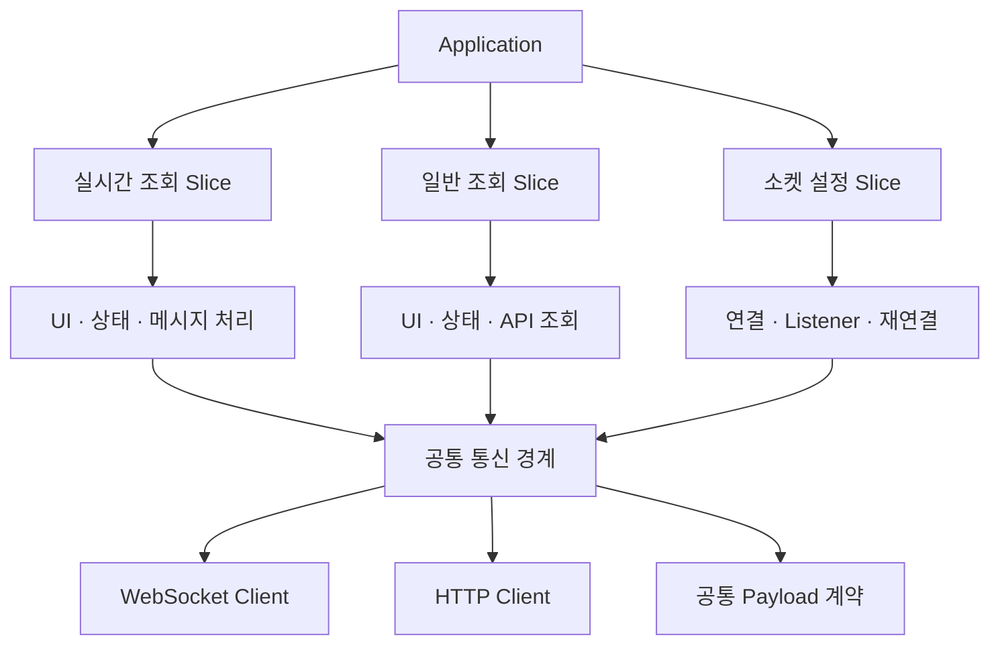

# 🤖 원격 제어 및 모니터링

**2025.08 – 2025.12 · ㈜TSM Technology · 과장 · FE 개발 · AWS 서버 구축**

AWS IoT Core 기반 현장 장비 원격 제어 및 실시간 모니터링 시스템.
<br/>중복 메시지, 소켓 재생성, Listener 누수, 장애 추적 부재를 데이터 처리, 연결 생명주기, 기능 구조, 운영 관측 관점에서 정리한 프로젝트입니다.

## 기술 스택

`React` `Node.js` `TypeScript` `Redux` `SSE` `WebSocket` `AWS IoT Core` `Lambda` `DynamoDB` `S3` `Athena` `CloudWatch`

---

## 성과 요약

| 항목 | 문제 | 적용 | 결과 |
|---|---|---|---|
| MQTT 멱등성 | 동일 메시지가 반복 저장되어 제어 지연 누적 | Lambda 중간 계층 + `messageId` 기준 멱등성 검증 | 제어 지연 **10초+ → 1초 이내** |
| WebSocket 연결 구조 | 화면마다 소켓과 Listener를 개별 생성 | 공통 소켓 모듈과 연결 상태 관리 일원화 | 소켓 생성 지점 **3개 → 1개**, **67% 축소** |
| 메시지 수신 안정성 | 중복 구독과 잘못된 cleanup으로 메시지 누락 발생 | 화면 단위 등록·해제 기준 정리 | 수신 성공률 **15% → 100%** |
| 구조 분리 | 실시간·일반 조회·소켓 로직이 전역에 분산돼 기능 변경 시 여러 계층 동시 수정 | 기능 단위 Slice로 분리하는 VSA 구조 전환 | 수정 영향 범위 **약 40% 감소** |
| 운영 관측 | 장애 발생 후 원인 추적이 느림 | S3 로그, Athena 분석, CloudWatch Alarm 구성 | 장애 대응 **3일 → 1일 이내** |

---

## 이 프로젝트에서 맡은 역할

- 프론트엔드 구조 개선과 함께 AWS 서버 구성까지 담당했습니다.
- MQTT 메시지 처리, WebSocket 연결 생명주기, 장애 추적 흐름을 함께 정리했습니다.
- 실시간 제어 구조를 화면 단위 문제가 아니라 전체 데이터 흐름 기준으로 다시 설계했습니다.

---

## 핵심 문제

원격 제어 시스템에서는 명령을 보내는 것보다, 그 명령이 장비에 반영되고 다시 화면에 안정적으로 동기화되는 전체 흐름이 더 중요했습니다.

실제로는 다음 문제가 함께 얽혀 있었습니다.

- MQTT QoS 1 특성 때문에 동일 메시지가 중복 전달됨
- 화면마다 소켓과 Listener를 개별 생성해 재진입 시 중복 구독 발생
- 실시간 조회·일반 조회·상태 관리가 전역에 분산되어 변경 영향 범위가 큼
- 장애 발생 시 요청부터 장비 응답까지 추적할 로그와 선제 대응 체계가 부족함

그래서 일부 화면만 빠르게 만드는 접근이 아니라, 데이터 처리, 연결 생명주기, 구조 분리, 운영 관측을 각각 손보는 방식으로 접근했습니다.

---

## 1. Lambda · DynamoDB 기반 MQTT 멱등성

가장 먼저 정리한 부분은 중복 메시지 처리였습니다. 초기 구조에서는 MQTT로 들어온 메시지가 직접 저장되면서 같은 데이터가 여러 건씩 누적됐고, 이 누적이 저장 부담과 제어 지연으로 이어졌습니다.

그래서 Lambda에서 `messageId` 기준 멱등성 로직을 두고, 이미 처리된 메시지는 저장과 후속 전달에서 제외하도록 구성했습니다.

### 결과

- 중복 메시지 처리 제거
- 불필요한 후속 전달 제거
- 장비 제어 지연 10초+ → 1초 이내

```ts title="domain.ts"
// 설명용 예시: 실제 Lambda·Table·SDK 호출이 아님

// 1. 중복 검사 — 이미 처리한 메시지인지 확인
export async function 메시지처리(메시지) {
  const 중복여부 = await db.send(new GetItemCommand({
    "식별자 기반 조회 키"
  }))

  if (중복여부.Item) "중복으로 응답하고 즉시 종료"

  // 2. 신규 메시지만 저장 (TTL로 자동 만료)
  await db.send(new PutItemCommand({
    "식별자, 처리 시각, TTL 등"
  }))

  // 3. 상태 반영 + 실시간 전파
  await updateState(/* 대상 식별자, 처리 내용 */)
  await broadcastToClients(/* 구독 클라이언트에 상태 전파 */)

  return { statusCode: 200, body: 'processed' }
}
```

---

## 2. WebSocket 연결 생명주기와 Listener 정리

화면마다 소켓과 Listener를 따로 만들면 화면 전환이나 재진입 때 연결 기준이 흔들리고, 중복 구독과 누락이 함께 발생합니다.

그래서 다음 기준으로 구조를 정리했습니다.

- 공통 소켓 모듈로 연결 지점 통합
- 연결 상태 관리 일원화
- 컴포넌트 생명주기에 맞춘 Listener 등록·해제
- 화면 단위 cleanup 기준 명확화

### 결과

- 소켓 생성 지점 3개 → 1개, 67% 축소
- 동일 테스트 기준 메시지 수신 성공률 15% → 100%
- 화면 전환 시 재연결 대기 제거

```ts title="domain.ts"
// 설명용 예시: 실제 Socket 모듈과 이벤트명이 아님

// WebSocket 구독 → 중복 수신 필터 → 상태 반영
useEffect(() => {
  const 구독해제 = 소켓.subscribe(/* 구독 채널 */, (메시지) => {
    "중복 수신이면 상태 반영 안 함"
    dispatch(applyState(/* 수신 상태 반영 */))
  })

  return 구독해제
}, [/* 의존성 */])
```

---

## 3. VSA 기반 실시간 통신·조회 구조 분리

실시간 소켓, 일반 조회, 상태 관리 로직이 전역 레이어에 섞여 있으면 기능 하나를 바꿀 때 여러 계층을 같이 건드리게 됩니다.

그래서 실시간 조회, 일반 조회, 소켓 설정을 분리할 수 있는 구조로 정리했고, 각 영역의 API·상태·UI 의존성을 안쪽으로 모았습니다. 반복 사용이 확인된 통신 코드만 공통 경계로 승격하고, 나머지는 각 Slice 내부에 유지했습니다.



이 구조 덕분에 실시간 통신 로직을 다른 화면과 덜 엮인 상태로 유지할 수 있었고, 제어 흐름 개선을 안정적으로 누적할 수 있었습니다.

### 결과

- 기능 변경 시 수정 영향 범위 약 40% 감소
- 실시간 통신 로직의 재사용성과 유지보수성 개선
- 기능 변경 시 확인해야 하는 코드와 테스트 범위 축소
- 실시간 통신 장애의 원인 추적 시간 단축
- 기능 추가 과정에서 다른 화면에 미치는 영향 감소
- 담당자 간 개발 영역과 코드 리뷰 범위 명확화
- 공통 Socket 변경 시 적용 지점 일원화

---

## 4. S3 · Athena · CloudWatch 기반 운영 관측

장애는 고치는 것만큼이나 **빨리 원인을 좁히는 것**이 중요했습니다. 특히 현장 장비 이전 과정에서 MQTT Key와 Payload 구조 변경이 생기면, 요청부터 응답까지 추적할 수단이 없으면 대응 시간이 길어집니다.

그래서 다음 구성을 붙였습니다.

- MQTT 로그 S3 저장
- Athena 이력 분석 환경 구성
- CloudWatch Alarm 연동

### 결과

- 사용자 신고 이후 확인하던 방식에서 알람 기반 선제 대응으로 전환
- 장애 원인 파악부터 해결까지 3일 → 1일 이내

```sql title="domain.sql"
-- 설명용 예시: 실제 테이블과 컬럼명이 아님
SELECT
  messageId,
  deviceId,
  COUNT(*) AS receivedCount
FROM domain_message_logs
WHERE /* 기간 조건 */
GROUP BY messageId, deviceId
HAVING COUNT(*) > 1
ORDER BY receivedCount DESC;
```

자세한 분석 흐름과 멱등성 대응은 [멱등성 검증 & 중복 필터](../realtime/dedup-idempotency.md) 문서에 따로 정리했습니다.
