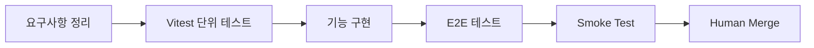

# 테스트 기반 개발

기능을 빠르게 추가하는 것만으로는 운영 프로젝트의 품질을 지키기 어려웠습니다.
그래서 핵심 로직은 테스트를 먼저 생각하는 방식으로 진행하고, 구현 이후에는 `Vitest`, `E2E`, `Smoke Test`까지 이어지는 검증 흐름으로 마무리했습니다.

---

## 검증 흐름



---

## 1. Vitest로 도메인 로직부터 확인

핵심 로직은 구현 전에 기대 결과를 먼저 확인하는 방식으로 진행했습니다.
목표는 기능을 빨리 만드는 것이 아니라, 변경이 들어와도 규칙이 흔들리지 않게 만드는 것이었습니다.

예시 코드입니다. 일반적인 패턴을 기반으로, 도메인 특성에 맞게 재구성해 적용했습니다.

```ts title="domain-logic.test.ts"
describe('domain logic', () => {
  it('returns expected result', () => {
    expect(runLogic(input)).toEqual(output);
  });
});
```

실제로는 도메인 규칙을 먼저 테스트로 확인한 뒤 구현을 진행했고, 로직 변경 시 관련 테스트를 함께 갱신했습니다.

---

## 2. E2E로 사용자 흐름 검증

단위 테스트만 통과해도 실제 화면 흐름에서 문제가 생길 수 있었기 때문에, 주요 시나리오는 E2E 테스트로 다시 검증했습니다.

예시 코드입니다. 일반적인 패턴을 기반으로, 도메인 특성에 맞게 재구성해 적용했습니다.

```ts title="flow.e2e.ts"
test('user flow', async ({ page }) => {
  await page.goto('/entry');
  await page.getByRole('button', { name: '확인' }).click();
  await expect(page.getByText('완료')).toBeVisible();
});
```

실제로는 로그인, 조회, 등록, 수정처럼 화면 간 이동이 포함된 주요 사용자 흐름을 중심으로 검증했습니다.

---

## 3. Smoke Test로 최종 확인

자동 테스트가 모두 끝난 뒤에도, 배포 직전에는 실제로 가장 중요한 흐름이 정상 동작하는지 다시 확인했습니다.

예시 체크리스트입니다.

```md title="smoke-test.md"
- 로그인 진입 확인
- 핵심 목록 조회 확인
- 주요 등록/수정 흐름 확인
- 권한/리다이렉트 확인
```

스모크 테스트까지 통과하면 최종 머지는 사람이 직접 진행했습니다.

---

## 운영 방식

- 핵심 로직은 테스트를 먼저 생각하는 방식으로 진행
- 구현 후에는 Vitest로 로직 검증
- 주요 사용자 흐름은 E2E로 재검증
- 배포 직전에는 Smoke Test로 최종 확인
- 최종 머지는 사람이 직접 판단

이 흐름 덕분에 기능 추가 속도와 운영 품질을 함께 유지할 수 있었습니다.
