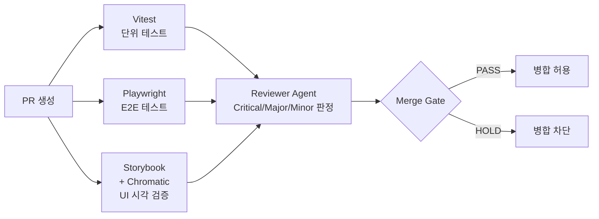

import Tabs from '@theme/Tabs';
import TabItem from '@theme/TabItem';

# Merge Gate — 심각도 기반 병합 차단

---

PR 병합 전에 코드 품질을 자동으로 검증하고,
Critical/Major 이슈가 미해결 상태일 때 병합을 자동 차단하는 시스템입니다.

---

## 심각도 분류

| 심각도 | 설명 | 병합 정책 |
|---|---|---|
| **Critical** | 런타임 오류, 보안 취약점, 타입 안전성 위반 | 해결 전까지 **병합 차단** |
| **Major** | 성능 문제, 잘못된 패턴, 테스트 누락 | 해결 전까지 **병합 차단** |
| **Minor** | 코드 스타일, 네이밍 컨벤션 | 경고만 — 병합 허용 |

---

## 3중 품질 검증



---

## GitHub Actions Workflow

<Tabs>
  <TabItem value="ci" label="CI 파이프라인">

```yaml title="ci.yml"
name: CI — Merge Gate

on:
  pull_request:
    branches: [main, develop]

jobs:
  unit-test:
    name: Unit Tests (Vitest)
    runs-on: ubuntu-latest
    steps:
      - uses: actions/checkout@v4
      - uses: actions/setup-node@v4
        with: { node-version: '20' }
      - run: npm ci
      - run: npm run test:coverage
      - name: Upload coverage
        uses: codecov/codecov-action@v4

  e2e-test:
    name: E2E Tests (Playwright)
    runs-on: ubuntu-latest
    steps:
      - uses: actions/checkout@v4
      - uses: actions/setup-node@v4
        with: { node-version: '20' }
      - run: npm ci
      - run: npx playwright install --with-deps chromium
      - run: npm run test:e2e
      - uses: actions/upload-artifact@v4
        if: failure()
        with:
          name: playwright-report
          path: playwright-report/

  visual-test:
    name: Visual Tests (Chromatic)
    runs-on: ubuntu-latest
    steps:
      - uses: actions/checkout@v4
        with: { fetch-depth: 0 }
      - run: npm ci
      - uses: chromaui/action@latest
        with:
          projectToken: ${{ secrets.CHROMATIC_PROJECT_TOKEN }}
          exitZeroOnChanges: true   # 변경 감지 시 리뷰 요청 (차단 아님)

  type-check:
    name: TypeScript Type Check
    runs-on: ubuntu-latest
    steps:
      - uses: actions/checkout@v4
      - run: npm ci
      - run: npm run type-check   # tsc --noEmit
```

  </TabItem>
  <TabItem value="gate" label="Merge Gate 판정">

```yaml title="merge-gate.yml"
name: Merge Gate

on:
  pull_request:
    branches: [main]
  workflow_run:
    workflows: ['CI — Merge Gate']
    types: [completed]

jobs:
  severity-check:
    name: Severity Check & Gate Decision
    runs-on: ubuntu-latest
    needs: [unit-test, e2e-test, type-check]
    steps:
      - name: Check CI results
        id: severity
        run: |
          CRITICAL=0
          MAJOR=0

          # TypeScript 에러 → Critical
          if [ "${{ needs.type-check.result }}" == "failure" ]; then
            echo "CRITICAL: TypeScript type errors detected"
            CRITICAL=$((CRITICAL + 1))
          fi

          # 단위 테스트 실패 → Critical
          if [ "${{ needs.unit-test.result }}" == "failure" ]; then
            echo "CRITICAL: Unit tests failed"
            CRITICAL=$((CRITICAL + 1))
          fi

          # E2E 실패 → Major
          if [ "${{ needs.e2e-test.result }}" == "failure" ]; then
            echo "MAJOR: E2E tests failed"
            MAJOR=$((MAJOR + 1))
          fi

          echo "critical=$CRITICAL" >> $GITHUB_OUTPUT
          echo "major=$MAJOR" >> $GITHUB_OUTPUT

      - name: Gate Decision
        run: |
          CRITICAL="${{ steps.severity.outputs.critical }}"
          MAJOR="${{ steps.severity.outputs.major }}"

          if [ "$CRITICAL" -gt 0 ] || [ "$MAJOR" -gt 0 ]; then
            echo "❌ MERGE: HOLD — Critical: $CRITICAL, Major: $MAJOR"
            exit 1  # 병합 차단
          else
            echo "✅ MERGE: PASS"
          fi
```

  </TabItem>
</Tabs>

---

## Vitest 테스트 예시

```ts title="entity.schema.test.ts"
import { describe, it, expect } from 'vitest';
import { EntitySchema } from './entity.schema';

describe('EntitySchema', () => {
  it('유효한 도메인 데이터를 파싱한다', () => {
    const valid = {
      id: '*********************',
      entityId: 'entity-001',
      status: 'pending',
      scheduledAt: '2026-06-01T09:00:00Z',
      completedAt: null,
      assignee: { id: 'user-001', name: '홍길동' },
    };

    expect(EntitySchema.safeParse(valid).success).toBe(true);
  });

  it('잘못된 status 값을 거부한다', () => {
    const invalid = { ...validData, status: 'unknown' };
    const result = EntitySchema.safeParse(invalid);

    expect(result.success).toBe(false);
    expect(result.error?.issues[0].path).toContain('status');
  });

  it('completedAt은 null을 허용한다', () => {
    const withNull = { ...validData, completedAt: null };
    expect(EntitySchema.safeParse(withNull).success).toBe(true);
  });
});
```

---

## delta-only 재검증

수정 후 변경된 부분만 재검증해 검증 효율을 확보합니다.

```yaml title="delta-check.yml"
- name: Get changed files
  id: changed
  uses: tj-actions/changed-files@v44
  with:
    files: 'src/features/**'

- name: Run tests for changed features only
  if: steps.changed.outputs.any_changed == 'true'
  run: |
    # 변경된 feature 슬라이스만 테스트
    CHANGED_FEATURES=$(echo "${{ steps.changed.outputs.all_changed_files }}" \
      | tr ' ' '\n' \
      | grep -oP 'features/[^/]+' \
      | sort -u)

    for feature in $CHANGED_FEATURES; do
      npx vitest run "src/$feature"
    done
```

---

- Critical/Major 미해결 시 병합 자동 차단으로 품질 기준 강제화
- Vitest · Playwright · Storybook + Chromatic 3중 검증으로 코드·흐름·UI 전 영역 커버
- delta-only 재검증으로 검증 효율 확보
