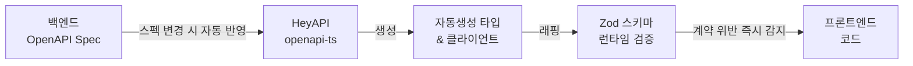

import Tabs from '@theme/Tabs';
import TabItem from '@theme/TabItem';

# OpenAPI → Zod 타입 자동화

**적용 프로젝트: FMS**

---

:::danger 문제
백엔드 API가 변경될 때마다 프론트엔드에서 타입을 수동으로 업데이트해야 했습니다.
누락이 잦았고, 런타임에서야 타입 불일치 버그를 발견하는 경우가 반복되었습니다.
:::

---

## 해결 전략



---

## 설정

```ts title="openapi-ts.config.ts"
import { defineConfig } from '@hey-api/openapi-ts';

export default defineConfig({
  input: 'http://api.internal/openapi.json', // 백엔드 스펙 URL
  output: {
    path: 'src/shared/api/generated',
    format: 'prettier',
  },
  plugins: [
    '@hey-api/client-axios',  // Axios 클라이언트 자동생성
    '@hey-api/sdk',           // 타입 안전 SDK 생성
    {
      name: '@hey-api/transformers',
      dates: true,            // string → Date 자동 변환
    },
    'zod',                    // Zod 스키마 자동생성
  ],
});
```

```json title="package.json (scripts)"
{
  "scripts": {
    "codegen": "openapi-ts",
    "codegen:watch": "openapi-ts --watch"
  }
}
```

---

## 자동생성 결과물 활용

<Tabs>
  <TabItem value="generated" label="자동생성 타입">

```ts title="src/shared/api/generated/types.gen.ts (자동생성)"
// ⚠️ 수동 편집 금지 — openapi-ts가 자동 생성합니다

export type Inspection = {
  id: string;
  facilityId: string;
  status: 'pending' | 'in_progress' | 'completed' | 'failed';
  scheduledAt: string;
  completedAt: string | null;
  inspector: {
    id: string;
    name: string;
  };
};

export type GetInspectionListData = {
  query?: {
    status?: Inspection['status'];
    facilityId?: string;
    page?: number;
  };
};

export type GetInspectionListResponse = {
  items: Inspection[];
  total: number;
  page: number;
};
```

  </TabItem>
  <TabItem value="zod-wrapper" label="Zod 런타임 검증">

```ts title="features/inspection/model/inspection.schema.ts"
import { z } from 'zod';
import type { Inspection } from '@/shared/api/generated/types.gen';

// 자동생성 타입에 Zod 스키마 추가 — 런타임 계약 검증
export const InspectionSchema = z.object({
  id: z.string().uuid(),
  facilityId: z.string().min(1),
  status: z.enum(['pending', 'in_progress', 'completed', 'failed']),
  scheduledAt: z.string().datetime(),
  completedAt: z.string().datetime().nullable(),
  inspector: z.object({
    id: z.string(),
    name: z.string().min(1),
  }),
}) satisfies z.ZodType<Inspection>; // 자동생성 타입과 일치 강제

export type ValidatedInspection = z.infer<typeof InspectionSchema>;
```

  </TabItem>
  <TabItem value="usage" label="API 호출 시 검증">

```ts title="features/inspection/api/inspectionApi.ts"
import { client } from '@/shared/api/generated/client.gen';
import { InspectionSchema } from '../model/inspection.schema';

export async function getInspectionList(params: GetInspectionListData) {
  const response = await client.getInspectionList({ query: params.query });

  // 런타임에서 API 계약 검증
  const validated = response.data.items.map((item) => {
    const result = InspectionSchema.safeParse(item);

    if (!result.success) {
      // 계약 위반 즉시 감지 — 백엔드 변경 사항 즉시 파악
      console.error('API 계약 위반:', result.error.flatten());
      throw new Error(`API 스키마 불일치: ${result.error.message}`);
    }

    return result.data;
  });

  return { items: validated, total: response.data.total };
}
```

  </TabItem>
</Tabs>

---

## PR 자동화 — 스펙 변경 시 타입 갱신

```yaml title=".github/workflows/codegen.yml"
name: OpenAPI Codegen

on:
  push:
    branches: [main]

jobs:
  codegen:
    runs-on: ubuntu-latest
    steps:
      - uses: actions/checkout@v4

      - name: Install dependencies
        run: npm ci

      - name: Generate types from OpenAPI spec
        run: npm run codegen

      - name: Commit generated files
        uses: stefanzweifel/git-auto-commit-action@v5
        with:
          commit_message: 'chore: regenerate API types from OpenAPI spec'
          file_pattern: 'src/shared/api/generated/**'
```

백엔드 스펙이 변경되면 PR 머지 시 자동으로 타입이 재생성됩니다.
별도 커뮤니케이션 없이 API 계약을 코드로 관리합니다.

---

:::tip 결과
- 수동 타입 정의 제거 — 백엔드 스펙 변경 시 프론트 자동 반영
- Zod 런타임 검증으로 API 계약 위반 즉시 감지
- 백엔드 소통 비용 및 타입 불일치 버그 감소
:::
