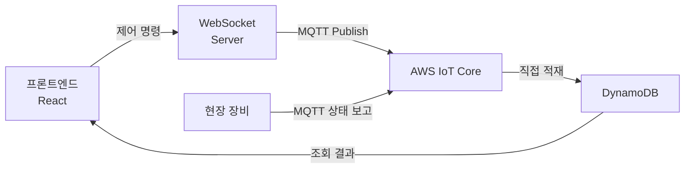

# AWS IoT Core 기반 원격 제어 시스템


---

현장 장비를 웹에서 원격 제어하는 시스템입니다.
초기에는 MQTT로 들어온 메시지가 DynamoDB에 직접 적재되는 구조였고, 이후 중복 저장과 지연을 줄이기 위해 AWS Lambda를 중간 처리 계층으로 추가했습니다.

---

## 구조 전환

### Before — MQTT direct write



이 구조에서는 같은 시각의 동일 데이터가 여러 건씩 직접 적재될 수 있어, 저장 부담과 이후 조회 부담이 함께 커졌습니다.

### After — Lambda 중간 처리 계층 추가


---

Lambda는 백엔드 애플리케이션 내부가 아니라 AWS Lambda 환경에 별도로 구현한 서버리스 중간 처리 계층입니다. 여기서 중복 검사와 저장 제어를 먼저 수행한 뒤 필요한 데이터만 DynamoDB에 반영하도록 바꿨습니다.

---

## 제어 흐름 단계별 설명

### 1단계 — 프론트엔드: 제어 명령 전송

예시 코드입니다. 일반적인 패턴을 기반으로, 도메인 특성에 맞게 재구성해 적용했습니다.

```ts title="domainAApi.ts"

export async function sendDomainACommand(command: DomainACommand) {
  const messageId = "멱등성 키 생성"

  return wsClient.send({
    type: 'DOMAIN_A_COMMAND',
    messageId,          // Lambda에서 중복 검증에 사용
    /* 제어 명령 payload */
  });
}
```

### 2단계 — AWS IoT Core Rule

MQTT 토픽 패턴을 기준으로 AWS IoT Core Rule을 구성하고, 직접 DynamoDB로 적재하던 흐름 대신 Rule Action으로 Lambda를 실행하도록 전환했습니다.

### 3단계 — Lambda: 중복 검사 + 상태 처리

예시 코드입니다. 일반적인 패턴을 기반으로, 도메인 특성에 맞게 재구성해 적용했습니다.

```ts title="domainAHandler.ts"
  // 1. 중복 검사 — 이미 처리한 messageId인지 확인
  const existing = await db.send(new GetItemCommand({
  "messageId 기반 조회 키"
  }));

  if (existing.Item) "중복으로 응답하고 즉시 종료" / "더 처리하지 않고 반환"
  
  // 2. 신규 메시지만 저장 (TTL로 자동 만료)
  await db.send(new PutItemCommand({
    "messageId, 처리 시각, TTL 등"
  }));
  // 3. 상태 반영 + 실시간 전파
  await updateState(/* 대상 식별자, 처리 내용 */);
  await broadcastToClients(/* 구독 클라이언트에 상태 전파 */);

  return { statusCode: 200, body: 'processed' };

```

### 4단계 — 프론트엔드: WebSocket 상태 동기화

예시 코드입니다. 일반적인 패턴을 기반으로, 도메인 특성에 맞게 재구성해 적용했습니다.

```ts title="useDomainASync.ts"
  // WebSocket 구독 → 중복 수신 필터 → 상태 반영
  useEffect(() => {
    const unsubscribe = wsClient.subscribe(/* 구독 채널 */, (message) => {
      "프론트 중복 렌더링 방지 로직 실행"
      dispatch(applyState(/* 수신 상태 반영 */));
    });

    return unsubscribe;
  }, [/* 의존성 */]);
```

---

## 운영 안정성 보강

예시 코드입니다. 일반적인 패턴을 기반으로, 도메인 특성에 맞게 재구성해 적용했습니다.

```yaml title="yaml"
DomainALambdaErrorAlarm:
  Type: AWS::CloudWatch::Alarm
  Properties:
    Threshold: <임계값>          # 예시값
    AlarmActions:
      - !Ref AlertSNSTopic  # SNS → 슬랙 알림

DomainALambdaDurationAlarm:
  Type: AWS::CloudWatch::Alarm
  Properties:
    Threshold: <임계값>         
    AlarmActions:
      - !Ref AlertSNSTopic
```

---

- direct write 구조 제거 후 제어 응답 지연 **10초+ → 1초 이내**
- 중복 저장 제거로 DB 부담 및 이후 조회 부담 감소
- CloudWatch Alarm으로 장애 즉시 감지 체계 확보
