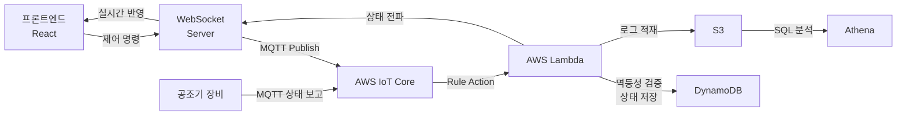

# AWS IoT Core 기반 공조기 제어 시스템

**적용 프로젝트: 공조기 자동제어**

---

:::info 개요
공조기 장비를 웹에서 원격 제어하는 시스템.
MQTT 프로토콜로 장비와 통신하고, AWS IoT Core → Lambda → WebSocket으로 상태를 실시간 반영합니다.
:::

---

## 전체 아키텍처



---

## 제어 흐름 단계별 설명

### 1단계 — 프론트엔드: 제어 명령 전송

```ts title="features/control/api/controlApi.ts"
import { v4 as uuidv4 } from 'uuid';

interface ControlCommand {
  deviceId: string;
  action: 'power_on' | 'power_off' | 'set_temperature';
  payload?: Record<string, unknown>;
}

export async function sendControlCommand(command: ControlCommand) {
  const messageId = uuidv4(); // 멱등성 키 생성

  return wsClient.send({
    type: 'CONTROL_COMMAND',
    messageId,              // Lambda에서 중복 검증에 사용
    timestamp: Date.now(),
    ...command,
  });
}
```

### 2단계 — AWS IoT Core Rule

```json title="IoT Rule (SQL)"
{
  "sql": "SELECT * FROM 'hvac/control/+'",
  "actions": [
    {
      "lambda": {
        "functionArn": "arn:aws:lambda:ap-northeast-2:...:function:hvac-control-handler"
      }
    }
  ]
}
```

### 3단계 — Lambda: 멱등성 검증 + 상태 처리

```ts title="lambda/hvac-control-handler.ts"
import { DynamoDBClient, GetItemCommand, PutItemCommand } from '@aws-sdk/client-dynamodb';

const db = new DynamoDBClient({ region: 'ap-northeast-2' });

export async function handler(event: IoTEvent) {
  const { messageId, deviceId, action, payload } = event;

  // 멱등성 검증 — 이미 처리한 messageId 확인
  const existing = await db.send(new GetItemCommand({
    TableName: 'hvac-control-idempotency',
    Key: { messageId: { S: messageId } },
  }));

  if (existing.Item) {
    console.log(`중복 메시지 스킵: ${messageId}`);
    return { statusCode: 200, body: 'duplicate' };
  }

  // 신규 메시지 처리
  await db.send(new PutItemCommand({
    TableName: 'hvac-control-idempotency',
    Item: {
      messageId: { S: messageId },
      deviceId: { S: deviceId },
      action: { S: action },
      processedAt: { S: new Date().toISOString() },
      ttl: { N: String(Math.floor(Date.now() / 1000) + 86400) }, // 24시간 TTL
    },
  }));

  // 장비 상태 업데이트 및 WebSocket 전파
  await updateDeviceState(deviceId, action, payload);
  await broadcastToClients(deviceId, { action, status: 'applied' });

  return { statusCode: 200, body: 'processed' };
}
```

### 4단계 — 프론트엔드: WebSocket 상태 동기화

```ts title="features/control/model/useControlSync.ts"
export function useControlSync(deviceId: string) {
  const dispatch = useDispatch();
  const processedIds = useRef(new Set<string>());

  useEffect(() => {
    const unsubscribe = wsClient.subscribe(
      `control:${deviceId}`,
      (message: ControlMessage) => {
        // 프론트 중복 렌더링 방지
        if (processedIds.current.has(message.messageId)) return;
        processedIds.current.add(message.messageId);

        dispatch(applyControlState({
          deviceId: message.deviceId,
          status: message.status,
          action: message.action,
        }));
      }
    );

    return unsubscribe;
  }, [deviceId, dispatch]);
}
```

---

## CloudWatch Alarm 설정

```yaml title="cloudwatch-alarms.yaml"
HvacLambdaErrorAlarm:
  Type: AWS::CloudWatch::Alarm
  Properties:
    AlarmName: hvac-control-lambda-errors
    MetricName: Errors
    Namespace: AWS/Lambda
    Statistic: Sum
    Period: 60
    EvaluationPeriods: 1
    Threshold: 5
    ComparisonOperator: GreaterThanOrEqualToThreshold
    AlarmActions:
      - !Ref AlertSNSTopic  # SNS → 슬랙 알림

HvacLambdaDurationAlarm:
  Type: AWS::CloudWatch::Alarm
  Properties:
    AlarmName: hvac-control-lambda-duration
    MetricName: Duration
    Namespace: AWS/Lambda
    Statistic: Average
    Period: 60
    EvaluationPeriods: 3
    Threshold: 5000          # 5초 초과 시 알림
    ComparisonOperator: GreaterThanOrEqualToThreshold
    AlarmActions:
      - !Ref AlertSNSTopic
```

---

:::tip 결과
- 제어 응답 지연 23초 → **1초 이내**
- 중복 메시지 처리 제거로 DB 비용 절감
- CloudWatch Alarm으로 장애 즉시 감지 체계 확보
:::
