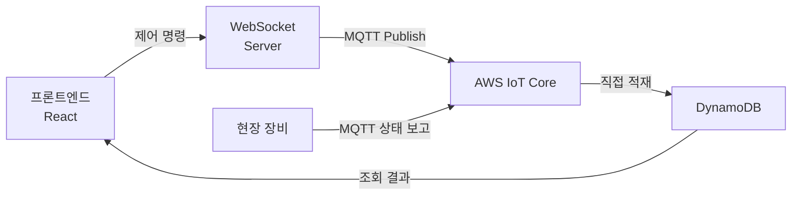

# AWS IoT Core 기반 원격 제어 시스템

MQTT 직접 적재 구조를 Lambda 중간 처리 계층으로 전환해, 현장 장비 원격 제어의 중복 저장과 응답 지연을 제거한 흐름입니다.

---

## 구조 전환 — MQTT 직접 적재 → Lambda 중간 계층

MQTT 메시지를 DynamoDB에 직접 쓰던 구조에서, 중복 검사와 저장 제어를 먼저 수행하는 Lambda 서버리스 계층을 앞단에 두었습니다.

### Before — MQTT direct write



동일 시각의 같은 데이터가 여러 건씩 직접 적재되어, 저장 부담과 조회 부담이 함께 커지는 구조였습니다.

### After — Lambda 중간 처리 계층 추가


Lambda는 백엔드 애플리케이션 내부가 아닌 AWS Lambda 환경의 별도 서버리스 계층으로, 중복 검사와 저장 제어를 먼저 수행한 뒤 필요한 데이터만 DynamoDB에 반영합니다.

---

## 제어 흐름 단계별 설명

### 1단계 — 프론트엔드: 제어 명령 전송

```ts title="domainAApi.ts"
export async function sendDomainACommand(command: DomainACommand) {
  const messageId = "멱등성 키 생성"

  return wsClient.send({
    type: 'DOMAIN_A_COMMAND',
    messageId,          // Lambda에서 중복 검증에 사용
    /* 제어 명령 payload */
  });
}
```

### 2단계 — AWS IoT Core Rule

MQTT 토픽 패턴 기준으로 Rule을 구성하고, 직접 DynamoDB 적재 대신 Rule Action으로 Lambda를 실행하도록 전환했습니다.

### 3단계 — Lambda: 중복 검사 + 상태 처리

```ts title="domainAHandler.ts"
  // 1. 중복 검사 — 이미 처리한 messageId인지 확인
  const existing = await db.send(new GetItemCommand({
  "messageId 기반 조회 키"
  }));

  if (existing.Item) "중복으로 응답하고 즉시 종료" / "더 처리하지 않고 반환"
  
  // 2. 신규 메시지만 저장 (TTL로 자동 만료)
  await db.send(new PutItemCommand({
    "messageId, 처리 시각, TTL 등"
  }));
  // 3. 상태 반영 + 실시간 전파
  await updateState(/* 대상 식별자, 처리 내용 */);
  await broadcastToClients(/* 구독 클라이언트에 상태 전파 */);

  return { statusCode: 200, body: 'processed' };

```

### 4단계 — 프론트엔드: WebSocket 상태 동기화

```ts title="useDomainASync.ts"
  // WebSocket 구독 → 중복 수신 필터 → 상태 반영
  useEffect(() => {
    const unsubscribe = wsClient.subscribe(/* 구독 채널 */, (message) => {
      "프론트 중복 렌더링 방지 로직 실행"
      dispatch(applyState(/* 수신 상태 반영 */));
    });

    return unsubscribe;
  }, [/* 의존성 */]);
```

---

## 운영 안정성 보강 — 알람 기반 즉시 감지

CloudWatch Alarm을 SNS·슬랙으로 연결해, 장애를 사용자 신고 전에 감지하도록 구성했습니다.

```yaml title="yaml"
DomainALambdaErrorAlarm:
  Type: AWS::CloudWatch::Alarm
  Properties:
    Threshold: <임계값>          # 예시값
    AlarmActions:
      - !Ref AlertSNSTopic  # SNS → 슬랙 알림

DomainALambdaDurationAlarm:
  Type: AWS::CloudWatch::Alarm
  Properties:
    Threshold: <임계값>         
    AlarmActions:
      - !Ref AlertSNSTopic
```

---

## 결과

- direct write 구조 제거로 제어 응답 지연 **10초+ → 1초 이내**
- 중복 저장 제거로 DB 부담·조회 부담 감소
- CloudWatch Alarm으로 장애 즉시 감지 체계 확보
