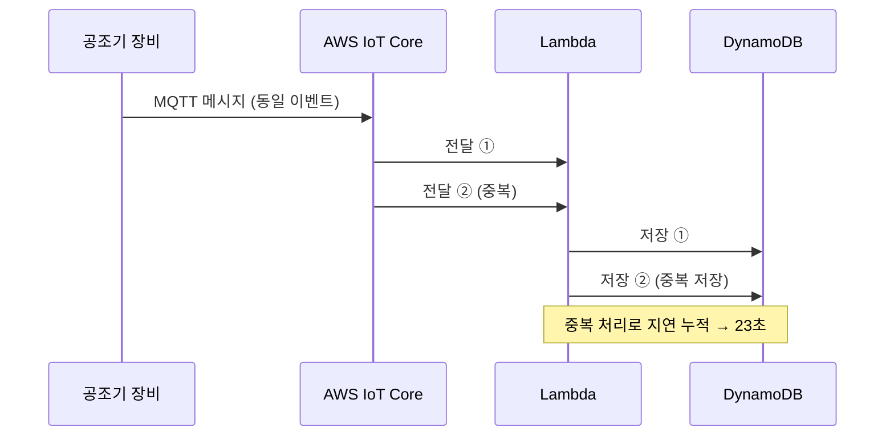
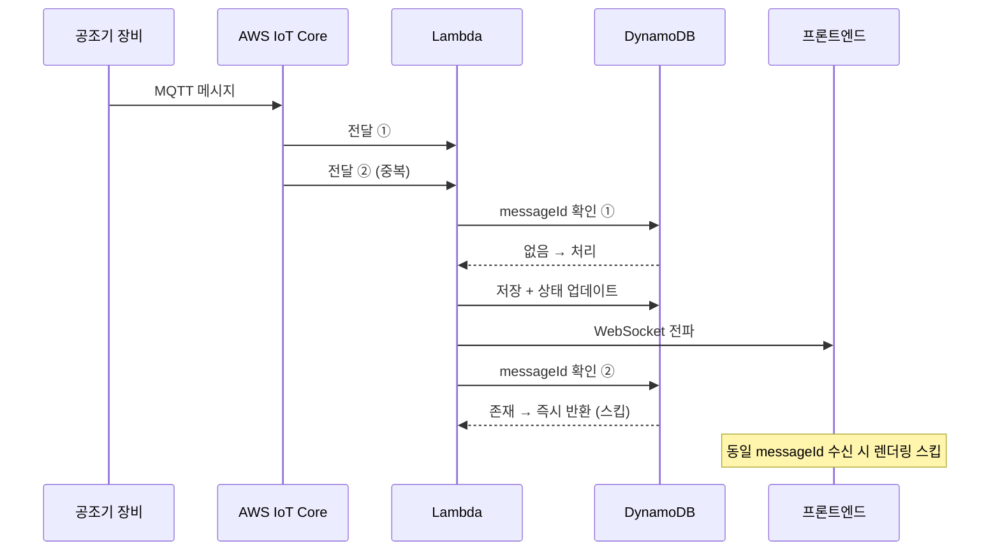

import Tabs from '@theme/Tabs';
import TabItem from '@theme/TabItem';

# 멱등성 검증 & 중복 이벤트 필터링

**적용 프로젝트: 공조기 자동제어**

---

:::danger 문제
제어 명령 전송 후 화면 반영까지 **23초 지연** 발생.
원인을 추적하자 동일한 MQTT 메시지가 IoT Core를 통해 Lambda에 **중복 전달**되고 있었습니다.
Lambda가 중복 처리되고, DynamoDB에 중복 저장되면서 처리 지연이 누적되었습니다.
:::

---

## 문제 원인 분석



MQTT QoS 설정에 따라 **at-least-once** 전달이 보장되어 중복이 발생할 수 있습니다.

---

## 해결책 1 — Lambda 멱등성 검증

<Tabs>
  <TabItem value="before" label="Before — 중복 처리">

```ts title="lambda/handler.ts (Before)"
export async function handler(event: IoTEvent) {
  // 중복 검증 없이 바로 처리
  await db.put({
    TableName: 'hvac-events',
    Item: {
      deviceId: event.deviceId,
      status: event.status,
      timestamp: event.timestamp,
    },
  });

  await broadcastToClients(event);
}
```

  </TabItem>
  <TabItem value="after" label="After — 멱등성 검증">

```ts title="lambda/handler.ts (After)"
export async function handler(event: IoTEvent) {
  const { messageId } = event;

  // 1. 처리 여부 확인
  const { Item } = await db.get({
    TableName: 'hvac-idempotency',
    Key: { messageId: { S: messageId } },
  });

  if (Item) {
    // 이미 처리된 메시지 → 즉시 반환
    return { statusCode: 200, body: 'already_processed' };
  }

  // 2. 처리 기록 저장 (TTL 24시간)
  await db.put({
    TableName: 'hvac-idempotency',
    Item: {
      messageId: { S: messageId },
      ttl: { N: String(Math.floor(Date.now() / 1000) + 86400) },
    },
    ConditionExpression: 'attribute_not_exists(messageId)', // 동시성 경쟁 방지
  });

  // 3. 실제 처리
  await processEvent(event);
  await broadcastToClients(event);
}
```

  </TabItem>
</Tabs>

---

## 해결책 2 — 프론트엔드 중복 렌더링 필터

WebSocket으로 동일 이벤트가 여러 번 도착할 경우를 대비해 프론트에서도 필터링합니다.

```ts title="features/monitoring/model/useEventFilter.ts"
export function useEventFilter() {
  // Set으로 처리된 messageId 추적
  const processedIds = useRef(new Set<string>());

  const filter = useCallback((event: DeviceEvent): boolean => {
    const key = `${event.messageId}`;

    if (processedIds.current.has(key)) {
      return false; // 중복 — 무시
    }

    processedIds.current.add(key);

    // 메모리 누수 방지: 1000개 초과 시 오래된 항목 제거
    if (processedIds.current.size > 1000) {
      const firstKey = processedIds.current.values().next().value;
      processedIds.current.delete(firstKey);
    }

    return true; // 신규 — 처리
  }, []);

  return { filter };
}
```

```ts title="features/monitoring/model/useDeviceEvents.ts"
export function useDeviceEvents(deviceId: string) {
  const dispatch = useDispatch();
  const { filter } = useEventFilter();

  useEffect(() => {
    const unsubscribe = wsClient.subscribe(
      `device:${deviceId}`,
      (event: DeviceEvent) => {
        if (!filter(event)) return; // 중복이면 Redux 업데이트 안 함

        dispatch(applyDeviceEvent(event));
      }
    );

    return unsubscribe;
  }, [deviceId]);
}
```

---

## 개선 후 흐름



---

:::tip 결과
- 제어 지연 **23초 → 1초 이내** 단축
- 실시간 메시지 전송량 약 **40% 감소** (중복 제거)
- DynamoDB 쓰기 비용 절감
- 오류율 **20%+** 감소
:::
