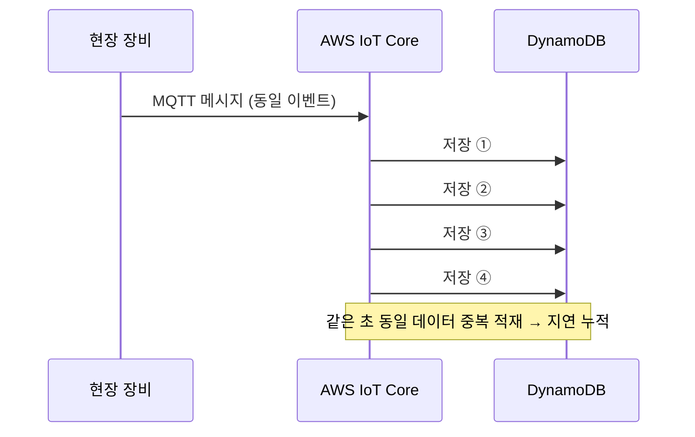
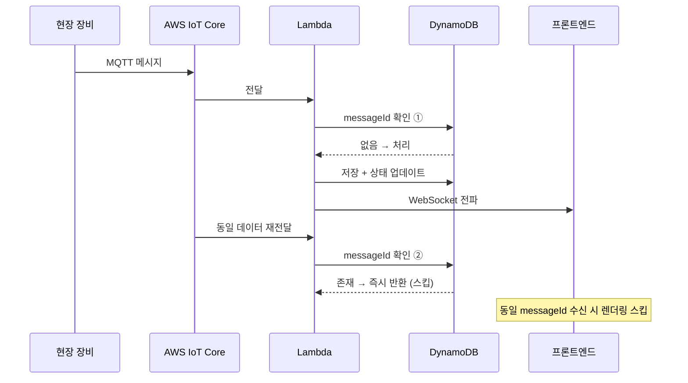

import Tabs from '@theme/Tabs';
import TabItem from '@theme/TabItem';

# 멱등성 검증 & 중복 이벤트 필터링


---

제어 명령 전송 후 화면 반영까지 **10초 이상 지연**이 발생했습니다.
원인을 추적하자 MQTT로 들어온 동일 데이터가 같은 시각과 초 단위로 여러 번 DynamoDB에 직접 적재되고 있었습니다.
중복 저장이 누적되면서 DB 부담이 커졌고, 이후 상태 반영과 조회 체감 지연도 함께 증가하고 있었습니다.

---

## 문제 원인 분석



MQTT QoS 특성과 direct write 구조가 결합되면서, 중복 데이터를 저장 단계에서 제어할 방법이 없었습니다.

다만 처음에는 "왜 같은 명령 하나에 동일 데이터가 여러 건씩 쌓이는가"를 특정하기 어려웠습니다. 실시간으로 흘러가는 MQTT 메시지를 눈으로 좇는 것만으로는 중복이 네트워크에서 생기는지, 장비에서 생기는지 구분할 수 없었기 때문입니다.

### 원인 추적 — S3 로그 적재 + Athena 분석

그래서 IoT Core로 들어오는 MQTT 메시지를 **S3에 원본 로그로 적재**하고, **Athena에서 SQL로 집계**해 중복이 어디서 얼마나 발생하는지 수치로 확인했습니다.

예시 코드입니다. 일반적인 패턴을 기반으로, 도메인 특성에 맞게 재구성해 적용했습니다.

```sql title="athena-duplicate-analysis.sql"
-- 제어 명령(messageId) 1건당 중복 수신 건수 집계
SELECT
  messageId,
  deviceId,
  COUNT(*) AS received_count
FROM iot_message_logs
WHERE /* 분석 기간 */
GROUP BY messageId, deviceId
HAVING COUNT(*) > 1
ORDER BY received_count DESC;
```

집계 결과, 문제는 네트워크가 아니라 **장비 쪽**에 있었습니다. 노후 장비가 실시간 1:1 응답을 처리하지 못하고, 제어 명령 한 번에 **동일한 메시지를 5~10건씩 반복 발행**하고 있었습니다. 이 중복이 누적되면서 장비 자체가 과부하로 멈추는 현상까지 이어졌고, 여기에 IoT Core의 at-least-once 전달 특성이 더해지면서 중복이 한층 증폭됐습니다.

원인을 "장비가 명령 1건당 다중 메시지를 발행한다"로 특정하고 나서야, 저장 이전 단계에서 중복을 걸러내는 멱등성 검증이라는 해법을 세울 수 있었습니다. 로그를 눈으로 좇는 대신 S3에 쌓인 원본을 SQL로 집계한 것이 원인 특정의 결정적 단서였습니다.

---

## 해결책 1 — Lambda 중간 계층 추가

예시 코드입니다. 일반적인 패턴을 기반으로, 도메인 특성에 맞게 재구성해 적용했습니다.

<Tabs>
  <TabItem value="before" label="Before — direct write">

```ts title="lambda handler example (Before)"
// MQTT 메시지가 별도 제어 없이 바로 저장
await db.put({
  "이벤트 상태 정보"
});
```

  </TabItem>
  <TabItem value="after" label="After — Lambda 멱등성 검증">

```ts title="lambda handler example (After)"
  // 1. 처리 여부 확인
  const { Item } = await db.get({
    "messageId 기반 조회"
  });

  if (Item) {
    "이미 처리된 메시지 → 즉시 반환"
  }

  // 2. 신규 메시지만 저장 — 조건부 쓰기로 동시성 경쟁 방지 (TTL로 자동 만료)
  await db.put({
    "messageId, TTL 등"
  });

  // 3. 실제 처리
  await processEvent(/* 이벤트 처리 */);
  await broadcastToClients(/* 구독 클라이언트에 상태 전파 */);
```

  </TabItem>
</Tabs>

---

:::note
위 코드는 AWS Lambda에 구현한 중복 검사 흐름을 설명하기 위한 예시입니다.
실제 구현은 AWS Lambda 환경에서 동작하도록 구성했습니다.
AWS Lambda는 백엔드 애플리케이션 내부가 아니라 AWS 환경에 별도로 둔 서버리스 중간 처리 계층입니다.
:::

---

## 해결책 2 — 프론트엔드 중복 렌더링 필터

WebSocket으로 동일 이벤트가 여러 번 도착할 경우를 대비해 프론트에서도 필터링합니다.

예시 코드입니다. 일반적인 패턴을 기반으로, 도메인 특성에 맞게 재구성해 적용했습니다.

```ts title="useEventFilter.ts"
  // Set으로 처리된 messageId 추적 → 중복 필터
  const filter = (event) => {
    if (processedIds.has(event.messageId)) return false; // 중복 — 무시
    processedIds.add(event.messageId);
    "메모리 누수 방지: 상한 초과 시 오래된 항목 제거 로직 실행"
    return true; // 신규 — 처리
  };
```

```ts title="useDomainAEvents.ts"
  // WebSocket 구독 → 중복 필터 → Redux 반영
  useEffect(() => {
    const unsubscribe = wsClient.subscribe(/* 구독 채널 */, (event) => {
      "중복이면 Redux 업데이트 안 함"
      dispatch(applyState(/* 수신 이벤트 반영 */));
    });

    return unsubscribe;
  }, [/* 의존성 */]);
```

---

## 개선 후 흐름



---

- 제어 지연 **10초+ → 1초 이내** 단축
- 같은 초 동일 데이터의 중복 저장 제거
- DynamoDB 저장 부담 및 이후 조회 부담 감소
- 오류율 **20%** 감소
