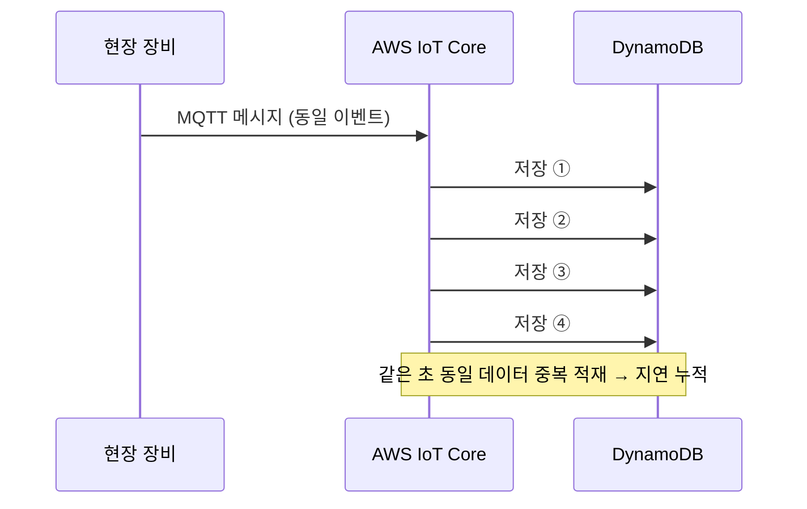
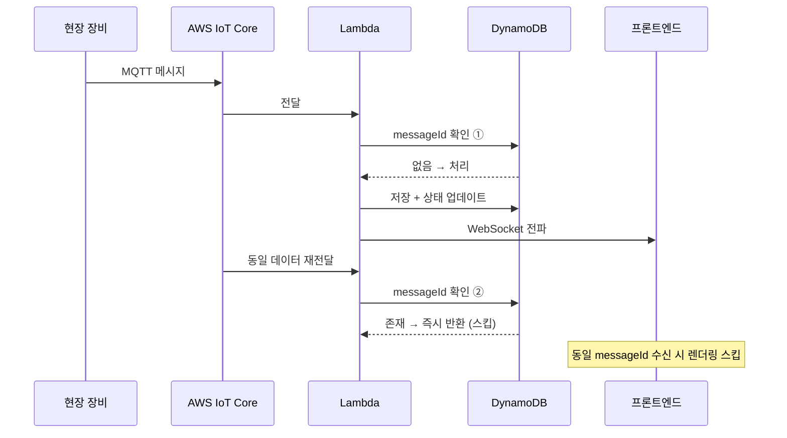

import Tabs from '@theme/Tabs';
import TabItem from '@theme/TabItem';

# 멱등성 검증 & 중복 이벤트 필터링

제어 명령 후 화면 반영까지 10초 이상 걸리던 지연을, MQTT 중복 적재를 저장 전 단계에서 걸러 1초 이내로 줄인 사례입니다.

- **문제** — MQTT 동일 데이터가 같은 초에 여러 번 DynamoDB에 직접 적재되어 저장 부담·조회 지연 누적
- **원인** — S3 로그를 Athena로 집계한 결과, 병목은 네트워크가 아니라 명령 1건당 동일 메시지를 5~10건 반복 발행하는 **노후 장비**로 특정
- **해결** — Lambda 중간 계층의 `messageId` 멱등성 검증 + 프론트 중복 렌더링 필터

---

## 문제 원인 분석 — 로그 집계로 병목을 장비로 특정

실시간 메시지를 눈으로 좇는 대신 S3 원본 로그를 SQL로 집계해, 중복이 어디서 얼마나 발생하는지 수치로 확인했습니다.



MQTT QoS 특성과 direct write 구조가 결합되면서, 저장 단계에서 중복을 제어할 방법이 없었습니다. 실시간 메시지만으로는 중복이 네트워크에서 생기는지 장비에서 생기는지 구분할 수 없었습니다.

### 원인 추적 — S3 로그 적재 + Athena 분석

IoT Core로 들어오는 MQTT 메시지를 S3에 원본 로그로 적재하고 Athena에서 SQL로 집계했습니다.

```sql title="athena-duplicate-analysis.sql"
-- 제어 명령(messageId) 1건당 중복 수신 건수 집계
SELECT
  messageId,
  deviceId,
  COUNT(*) AS received_count
FROM iot_message_logs
WHERE /* 분석 기간 */
GROUP BY messageId, deviceId
HAVING COUNT(*) > 1
ORDER BY received_count DESC;
```

집계 결과 병목은 네트워크가 아니라 **장비**였습니다. 노후 장비가 실시간 1:1 응답을 처리하지 못하고 명령 1건당 동일 메시지를 5~10건씩 반복 발행했고, IoT Core의 at-least-once 특성이 중복을 증폭시켰습니다. 원인을 특정하고 나서야 저장 전 단계의 멱등성 검증이라는 해법을 세울 수 있었습니다.

---

## 해결책 1 — Lambda 멱등성 검증으로 저장 전 중복 차단

MQTT 메시지를 바로 저장하지 않고, Lambda에서 `messageId` 처리 여부를 먼저 확인해 신규 메시지만 조건부 쓰기로 저장합니다.

<Tabs>
  <TabItem value="before" label="Before — direct write">

```ts title="lambda handler example (Before)"
// MQTT 메시지가 별도 제어 없이 바로 저장
await db.put({
  "이벤트 상태 정보"
});
```

  </TabItem>
  <TabItem value="after" label="After — Lambda 멱등성 검증">

```ts title="lambda handler example (After)"
  // 1. 처리 여부 확인
  const { Item } = await db.get({
    "messageId 기반 조회"
  });

  if (Item) {
    "이미 처리된 메시지 → 즉시 반환"
  }

  // 2. 신규 메시지만 저장 — 조건부 쓰기로 동시성 경쟁 방지 (TTL로 자동 만료)
  await db.put({
    "messageId, TTL 등"
  });

  // 3. 실제 처리
  await processEvent(/* 이벤트 처리 */);
  await broadcastToClients(/* 구독 클라이언트에 상태 전파 */);
```

  </TabItem>
</Tabs>

:::note
AWS Lambda는 백엔드 애플리케이션 내부가 아니라 AWS 환경에 별도로 둔 서버리스 중간 처리 계층입니다. 위 코드는 그 계층의 중복 검사 흐름을 설명하기 위한 예시입니다.
:::

---

## 해결책 2 — 프론트 중복 렌더링 필터

WebSocket으로 동일 이벤트가 여러 번 도착하는 경우에 대비해, 처리한 `messageId`를 추적해 프론트에서도 중복을 거릅니다.

```ts title="useEventFilter.ts"
  // Set으로 처리된 messageId 추적 → 중복 필터
  const filter = (event) => {
    if (processedIds.has(event.messageId)) return false; // 중복 — 무시
    processedIds.add(event.messageId);
    "메모리 누수 방지: 상한 초과 시 오래된 항목 제거 로직 실행"
    return true; // 신규 — 처리
  };
```

```ts title="useDomainAEvents.ts"
  // WebSocket 구독 → 중복 필터 → Redux 반영
  useEffect(() => {
    const unsubscribe = wsClient.subscribe(/* 구독 채널 */, (event) => {
      "중복이면 Redux 업데이트 안 함"
      dispatch(applyState(/* 수신 이벤트 반영 */));
    });

    return unsubscribe;
  }, [/* 의존성 */]);
```

---

## 개선 후 흐름



---

## 결과

- 제어 지연 **10초+ → 1초 이내** 단축
- 같은 초 동일 데이터의 중복 저장 제거
- DynamoDB 저장 부담·조회 부담 감소
- 오류율 **20% 감소**
