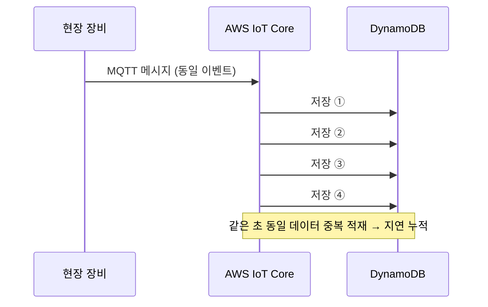
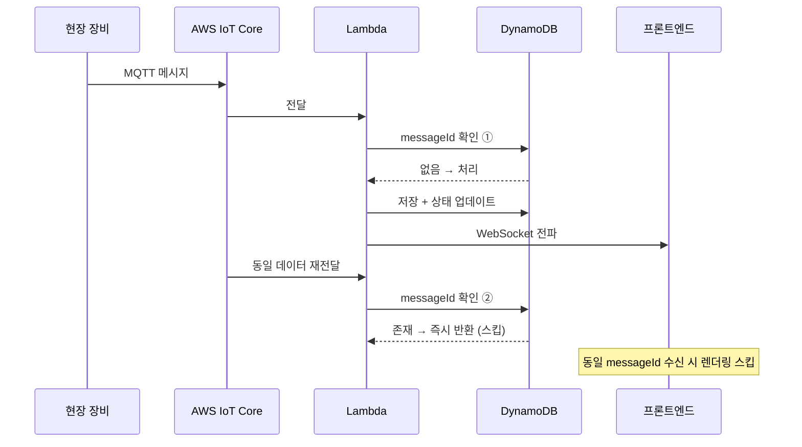

import Tabs from '@theme/Tabs';
import TabItem from '@theme/TabItem';

# 멱등성 검증 & 중복 이벤트 필터링


---

제어 명령 전송 후 화면 반영까지 **10초 이상 지연**이 발생했습니다.
원인을 추적하자 MQTT로 들어온 동일 데이터가 같은 시각과 초 단위로 여러 번 DynamoDB에 직접 적재되고 있었습니다.
중복 저장이 누적되면서 DB 부담이 커졌고, 이후 상태 반영과 조회 체감 지연도 함께 증가하고 있었습니다.

---

## 문제 원인 분석



MQTT QoS 특성과 direct write 구조가 결합되면서, 중복 데이터를 저장 단계에서 제어할 방법이 없었습니다.

---

## 해결책 1 — Lambda 중간 계층 추가

<Tabs>
  <TabItem value="before" label="Before — direct write">

```ts title="lambda handler example (Before)"
// MQTT 메시지가 별도 제어 없이 바로 저장
await db.put({
  TableName: 'domain-a-events',
  Item: {
    entityId: event.entityId,
    status: event.status,
    timestamp: event.timestamp,
  },
});
```

  </TabItem>
  <TabItem value="after" label="After — Lambda 멱등성 검증">

```ts title="lambda handler example (After)"
export async function handler(event: IoTEvent) {
  const { messageId } = event;

  // 1. 처리 여부 확인
  const { Item } = await db.get({
    TableName: 'domain-a-idempotency',
    Key: { messageId: { S: messageId } },
  });

  if (Item) {
    // 이미 처리된 메시지 → 즉시 반환
    return { statusCode: 200, body: 'already_processed' };
  }

  // 2. 처리 기록 저장 (TTL 24시간)
  await db.put({
    TableName: 'domain-a-idempotency',
    Item: {
      messageId: { S: messageId },
      ttl: { N: String(Math.floor(Date.now() / 1000) + 86400) },
    },
    ConditionExpression: 'attribute_not_exists(messageId)', // 동시성 경쟁 방지
  });

  // 3. 실제 처리
  await processEvent(event);
  await broadcastToClients(event);
}
```

  </TabItem>
</Tabs>

---

:::note
위 코드는 AWS Lambda에 구현한 중복 검사 흐름을 설명하기 위한 예시입니다.
실제 구현은 AWS Lambda 환경에서 동작하도록 구성했습니다.
AWS Lambda는 백엔드 애플리케이션 내부가 아니라 AWS 환경에 별도로 둔 서버리스 중간 처리 계층입니다.
:::

---

## 해결책 2 — 프론트엔드 중복 렌더링 필터

WebSocket으로 동일 이벤트가 여러 번 도착할 경우를 대비해 프론트에서도 필터링합니다.

```ts title="features/domain-monitoring/model/useEventFilter.ts"
export function useEventFilter() {
  // Set으로 처리된 messageId 추적
  const processedIds = useRef(new Set<string>());

  const filter = useCallback((event: DomainAEvent): boolean => {
    const key = `${event.messageId}`;

    if (processedIds.current.has(key)) {
      return false; // 중복 — 무시
    }

    processedIds.current.add(key);

    // 메모리 누수 방지: 1000개 초과 시 오래된 항목 제거
    if (processedIds.current.size > 1000) {
      const firstKey = processedIds.current.values().next().value;
      processedIds.current.delete(firstKey);
    }

    return true; // 신규 — 처리
  }, []);

  return { filter };
}
```

```ts title="useDomainAEvents.ts"
export function useDomainAEvents(entityId: string) {
  const dispatch = useDispatch();
  const { filter } = useEventFilter();

  useEffect(() => {
    const unsubscribe = wsClient.subscribe(
      `domain-a:${entityId}`,
      (event: DomainAEvent) => {
        if (!filter(event)) return; // 중복이면 Redux 업데이트 안 함

        dispatch(applyDomainAEvent(event));
      }
    );

    return unsubscribe;
  }, [entityId]);
}
```

---

## 개선 후 흐름



---

- 제어 지연 **10초+ → 1초 이내** 단축
- 같은 초 동일 데이터의 중복 저장 제거
- DynamoDB 저장 부담 및 이후 조회 부담 감소
- 오류율 **20%** 감소
