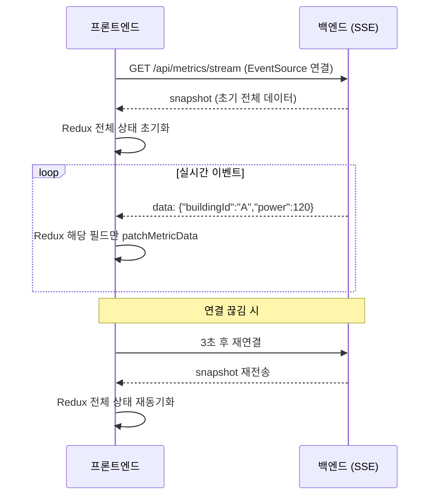

import Tabs from '@theme/Tabs';
import TabItem from '@theme/TabItem';

# SSE 도입으로 실시간 통신 개선


---

BEMS는 운영 지표 데이터를 실시간으로 보여줘야 합니다.
초기에는 3초마다 API를 반복 호출하는 **폴링 방식**을 사용했는데,
이벤트가 없어도 요청이 계속 나가 불필요한 네트워크 비용이 발생했습니다.
또한 화면 반영 지연이 3~5초에 달했습니다.

---

## Before — 폴링

<Tabs>
  <TabItem value="polling-hook" label="폴링 훅">

```ts title="useMetricPolling.ts"
export function useMetricPolling() {
  const dispatch = useDispatch();

  useEffect(() => {
    const fetchData = async () => {
      const data = await metricApi.getCurrent();
      dispatch(setMetricData(data));  // 전체 상태 교체
    };

    fetchData(); // 즉시 실행
    const interval = setInterval(fetchData, 3000); // 3초마다 반복

    return () => clearInterval(interval);
  }, [dispatch]);
}
```

  </TabItem>
  <TabItem value="polling-problem" label="문제점">

```
3초 간격 폴링 기준:
- 1분 = 20번 요청
- 1시간 = 1,200번 요청
- 이벤트 없는 야간 시간대도 동일하게 요청 발생

화면 반영 지연:
- 서버 데이터가 바뀌어도 최대 3초 후에 화면 갱신
```

  </TabItem>
</Tabs>

---

## After — SSE

<Tabs>
  <TabItem value="sse-hook" label="useSSEConnection 훅">

```ts title="useSSEConnection.ts"
interface SSEOptions {
  url: string;
  onMessage: (event: MessageEvent) => void;
  onError?: (event: Event) => void;
}

export function useSSEConnection({ url, onMessage, onError }: SSEOptions) {
  const eventSourceRef = useRef<EventSource | null>(null);

  useEffect(() => {
    const connect = () => {
      const es = new EventSource(url, { withCredentials: true });

      es.onmessage = onMessage;

      es.onerror = (event) => {
        onError?.(event);
        es.close();
        // 3초 후 재연결
        setTimeout(connect, 3000);
      };

      eventSourceRef.current = es;
    };

    connect();

    return () => {
      eventSourceRef.current?.close();
    };
  }, [url]);
}
```

  </TabItem>
  <TabItem value="sse-redux" label="Redux 부분 갱신">

```ts title="/metricSlice.ts"
const metricSlice = createSlice({
  name: 'metric',
  initialState,
  reducers: {
    // ❌ 전체 상태 교체 (폴링 방식)
    setMetricData(state, action) {
      return action.payload;
    },

    // ✅ 변경된 필드만 갱신 (SSE 방식)
    patchMetricData(state, action: PayloadAction<Partial<MetricData>>) {
      Object.assign(state, action.payload);
    },
  },
});
```

  </TabItem>
  <TabItem value="sse-snapshot" label="snapshot 재동기화">

```ts title="useMetricSSE.ts"
export function useMetricSSE() {
  const dispatch = useDispatch();

  // 초기 연결 시 최신 snapshot 로드
  useEffect(() => {
    metricApi.getSnapshot().then((snapshot) => {
      dispatch(setMetricData(snapshot));
    });
  }, []);

  // SSE로 이후 변경사항만 수신
  useSSEConnection({
    url: '/api/metrics/stream',
    onMessage: (event) => {
      const patch = JSON.parse(event.data) as Partial<MetricData>;
      dispatch(patchMetricData(patch)); // 변경된 필드만 갱신
    },
    onError: () => {
      // 재연결 후 snapshot 재동기화
      metricApi.getSnapshot().then((snapshot) => {
        dispatch(setMetricData(snapshot));
      });
    },
  });
}
```

  </TabItem>
</Tabs>

---

## SSE 흐름도



---

- 네트워크 요청 **60% 감소** (이벤트 발생 시에만 전송)
- 화면 반영 지연 3~5초 → **1초 이내** 단축
- Redux 부분 갱신으로 불필요한 리렌더링 제거
